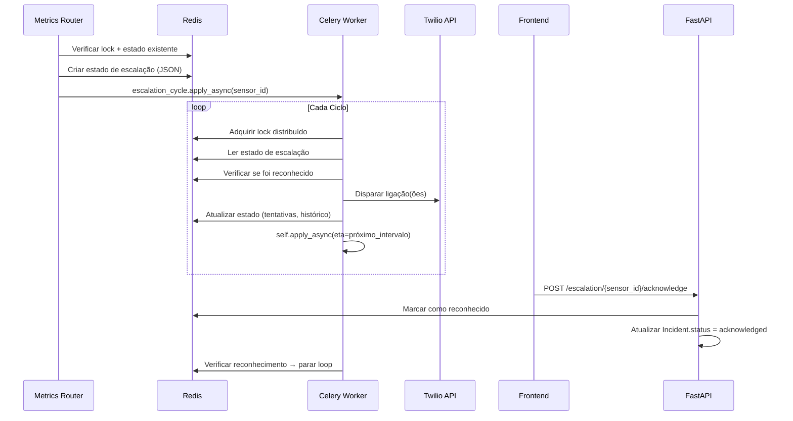

# Design — Escalação Contínua de Alarmes

## Visão Geral

Este design descreve a implementação do sistema de escalação contínua de alarmes para o Coruja Monitor. Atualmente, o sistema dispara uma única ligação de emergência via Twilio (em `_trigger_datacenter_emergency` no `api/routers/metrics.py`) com cooldown de 30 minutos, sem retentativas. A nova arquitetura introduz um loop de escalação gerenciado por Celery tasks com estado persistido no Redis, permitindo ligações contínuas até reconhecimento explícito, com modos simultâneo e sequencial, configuração granular de parâmetros e seleção de recursos monitorados.

### Decisões de Design

1. **Estado no Redis, não no PostgreSQL**: O estado de escalação ativa (tentativas, próxima execução, locks) fica no Redis para performance e atomicidade. O PostgreSQL registra apenas o histórico final no campo `ai_analysis` do Incident (reaproveitando JSON existente).
2. **Celery self-scheduling**: Cada ciclo de escalação agenda o próximo via `apply_async(eta=...)`, evitando beat schedules fixos e permitindo intervalos configuráveis por tenant.
3. **Integração não-invasiva**: O ponto de entrada é a função `_trigger_datacenter_emergency` existente, que será modificada para iniciar a escalação ao invés de disparar uma única ligação.
4. **Configuração dentro de `notification_config`**: Os parâmetros de escalação ficam no objeto `escalation` dentro do JSON `notification_config` do Tenant, sem necessidade de migração de schema.

## Arquitetura

```mermaid
flowchart TD
    A[Métrica Crítica Detectada] --> B{Recurso na lista de escalação?}
    B -->|Sim| C[Iniciar Escalação]
    B -->|Não| D[Fluxo Padrão de Notificação]
    
    C --> E[Criar Estado no Redis]
    E --> F[Celery Task: escalation_cycle]
    
    F --> G{Modo de Chamada?}
    G -->|Simultâneo| H[Ligar para todos os números]
    G -->|Sequencial| I[Ligar para próximo número]
    
    H --> J[Registrar Tentativa]
    I --> J
    
    J --> K{Alarme Reconhecido?}
    K -->|Sim| L[Parar Escalação + Limpar Redis]
    K -->|Não| M{Max Retentativas?}
    M -->|Sim| N[Escalação Expirada + Log]
    M -->|Não| O[Agendar Próximo Ciclo via apply_async]
    O --> F
    
    P[Botão Reconhecer no Frontend] --> Q[POST /api/v1/escalation/{sensor_id}/acknowledge]
    Q --> L
    
    R[Incidente Resolvido Automaticamente] --> L
    S[POST /incidents/{id}/acknowledge] --> L
```

### Fluxo de Dados



## Componentes e Interfaces

### 1. Backend — Módulo de Escalação (`worker/escalation.py`)

Novo módulo contendo a lógica central de escalação, separado do `tasks.py` existente.

```python
# Estrutura do estado de escalação no Redis
EscalationState = {
    "sensor_id": int,
    "incident_id": int,
    "tenant_id": int,
    "attempt_count": int,          # Tentativas realizadas
    "max_attempts": int,           # Máximo configurado
    "interval_minutes": int,       # Intervalo entre ciclos
    "call_duration_seconds": int,  # Duração máxima da chamada
    "mode": str,                   # "simultaneous" | "sequential"
    "current_number_index": int,   # Índice atual (modo sequencial)
    "phone_numbers": list[dict],   # [{name, number}]
    "status": str,                 # "active" | "acknowledged" | "expired"
    "started_at": str,             # ISO 8601
    "next_attempt_at": str,        # ISO 8601
    "last_attempt_at": str | None, # ISO 8601
    "acknowledged_by": int | None, # user_id
    "acknowledged_at": str | None, # ISO 8601
    "call_history": list[dict],    # [{number, timestamp, result}]
    "device_type": str,            # "nobreak" | "ar-condicionado" | "custom"
    "problem_description": str
}
```

#### Funções Principais

| Função | Descrição |
|--------|-----------|
| `start_escalation(sensor_id, incident_id, tenant_id, alert_data)` | Cria estado no Redis e agenda primeira task |
| `escalation_cycle(sensor_id)` | Celery task — executa um ciclo de ligações |
| `acknowledge_escalation(sensor_id, user_id, notes)` | Marca escalação como reconhecida no Redis |
| `get_active_escalations(tenant_id)` | Retorna lista de escalações ativas |
| `stop_escalation(sensor_id, reason)` | Para escalação por qualquer motivo |
| `serialize_state(state) -> str` | Serializa estado para JSON |
| `deserialize_state(json_str) -> dict` | Deserializa JSON para estado |

### 2. Backend — Celery Tasks (`worker/tasks.py`)

Nova task registrada no Celery app:

```python
@app.task(bind=True, max_retries=3, default_retry_delay=30)
def escalation_cycle(self, sensor_id: int):
    """Executa um ciclo de escalação para o sensor."""
    ...
```

### 3. Backend — API Endpoints (`api/routers/escalation.py`)

Novo router FastAPI:

| Endpoint | Método | Descrição |
|----------|--------|-----------|
| `/api/v1/escalation/active` | GET | Lista escalações ativas do tenant |
| `/api/v1/escalation/{sensor_id}/acknowledge` | POST | Reconhece alarme e para escalação |
| `/api/v1/escalation/config` | GET | Retorna configuração de escalação do tenant |
| `/api/v1/escalation/config` | PUT | Atualiza configuração de escalação |
| `/api/v1/escalation/resources` | GET | Lista recursos monitorados para escalação |
| `/api/v1/escalation/resources` | PUT | Atualiza lista de recursos monitorados |
| `/api/v1/escalation/history` | GET | Histórico recente de escalações encerradas |

### 4. Frontend — Componente de Escalação (`frontend/src/components/EscalationConfig.js`)

Novo componente React com três seções:

1. **Configuração de Parâmetros**: Modo de chamada, intervalo, retentativas, duração da chamada
2. **Cadeia de Escalação**: Lista de números com drag-and-drop para reordenação
3. **Recursos Monitorados**: Seletor de servidores/sensores/standalone com busca
4. **Alarmes Ativos**: Lista em tempo real com botão de reconhecimento (polling 10s)
5. **Histórico Recente**: Escalações encerradas recentemente

### 5. Integração com Fluxo Existente

Modificações em código existente:

| Arquivo | Modificação |
|---------|-------------|
| `api/routers/metrics.py` | `_trigger_datacenter_emergency` → chamar `start_escalation` ao invés de ligação direta |
| `api/routers/incidents.py` | `acknowledge_incident` → chamar `stop_escalation` quando incidente é reconhecido |
| `worker/tasks.py` | `evaluate_all_thresholds` → ao auto-resolver incidente, chamar `stop_escalation` |
| `api/main.py` | Registrar novo router `escalation` |
| `frontend/src/components/Sidebar.js` | Adicionar link para página de escalação |
| `frontend/src/components/MainLayout.js` | Adicionar rota para `EscalationConfig` |

## Modelos de Dados

### Estado de Escalação (Redis)

Chave: `escalation:{sensor_id}`
TTL: Calculado como `max_attempts * interval_minutes * 60 + 3600` (margem de 1h)

```json
{
    "sensor_id": 42,
    "incident_id": 1001,
    "tenant_id": 1,
    "attempt_count": 3,
    "max_attempts": 10,
    "interval_minutes": 5,
    "call_duration_seconds": 30,
    "mode": "sequential",
    "current_number_index": 1,
    "phone_numbers": [
        {"name": "João Silva", "number": "+5511999999999"},
        {"name": "Maria Santos", "number": "+5511888888888"}
    ],
    "status": "active",
    "started_at": "2025-01-15T10:30:00Z",
    "next_attempt_at": "2025-01-15T10:45:00Z",
    "last_attempt_at": "2025-01-15T10:40:00Z",
    "acknowledged_by": null,
    "acknowledged_at": null,
    "call_history": [
        {"number": "+5511999999999", "timestamp": "2025-01-15T10:30:00Z", "result": "completed"},
        {"number": "+5511888888888", "timestamp": "2025-01-15T10:35:00Z", "result": "no-answer"},
        {"number": "+5511999999999", "timestamp": "2025-01-15T10:40:00Z", "result": "completed"}
    ],
    "device_type": "nobreak",
    "problem_description": "Queda de Fase A, tensão 85 volts"
}
```

### Lock Distribuído (Redis)

Chave: `escalation_lock:{sensor_id}`
TTL: `interval_minutes * 60 + 60` (margem de 1 minuto)
Valor: `worker_id` (hostname do Celery worker)

### Configuração de Escalação (PostgreSQL — `Tenant.notification_config`)

Adicionado ao JSON existente do campo `notification_config`:

```json
{
    "twilio": { "...config existente..." },
    "escalation": {
        "enabled": true,
        "mode": "sequential",
        "interval_minutes": 5,
        "max_attempts": 10,
        "call_duration_seconds": 30,
        "phone_chain": [
            {"name": "João Silva", "number": "+5511999999999", "order": 1},
            {"name": "Maria Santos", "number": "+5511888888888", "order": 2}
        ],
        "escalation_resources": [
            {"type": "sensor", "id": 42, "name": "Nobreak Datacenter"},
            {"type": "sensor", "id": 43, "name": "Ar-Condicionado HVAC"},
            {"type": "server", "id": 10, "name": "Servidor Crítico DB"}
        ]
    }
}
```

### Validação de Parâmetros

| Parâmetro | Tipo | Padrão | Mínimo | Máximo |
|-----------|------|--------|--------|--------|
| `interval_minutes` | int | 5 | 1 | 60 |
| `max_attempts` | int | 10 | 1 | 100 |
| `call_duration_seconds` | int | 30 | 10 | 120 |
| `mode` | str | "sequential" | — | — |
| `phone_chain[].number` | str | — | formato E.164 | — |


## Propriedades de Corretude

*Uma propriedade é uma característica ou comportamento que deve ser verdadeiro em todas as execuções válidas de um sistema — essencialmente, uma declaração formal sobre o que o sistema deve fazer. Propriedades servem como ponte entre especificações legíveis por humanos e garantias de corretude verificáveis por máquina.*

### Propriedade 1: Início de escalação cria estado válido

*Para qualquer* alerta crítico de datacenter com dados válidos (sensor_id, incident_id, tenant_id, phone_chain não vazia), chamar `start_escalation` deve criar um estado no Redis contendo todos os campos obrigatórios (sensor_id, incident_id, attempt_count=0, status="active", phone_numbers, mode, started_at) e agendar a primeira task de ciclo.

**Valida: Requisitos 1.1**

### Propriedade 2: Escalação continua enquanto não reconhecida e abaixo do máximo

*Para qualquer* estado de escalação ativo onde `attempt_count < max_attempts` e `status == "active"`, executar um ciclo de escalação deve incrementar `attempt_count` e agendar o próximo ciclo com `eta = now + interval_minutes`.

**Valida: Requisitos 1.2**

### Propriedade 3: Escalação para ao atingir máximo de tentativas

*Para qualquer* estado de escalação onde `attempt_count >= max_attempts`, o ciclo de escalação deve definir `status = "expired"` e não agendar novo ciclo.

**Valida: Requisitos 1.3**

### Propriedade 4: Histórico de chamadas cresce a cada ciclo

*Para qualquer* ciclo de escalação executado com sucesso, o array `call_history` deve crescer pelo número de chamadas realizadas naquele ciclo (1 para modo sequencial, N para modo simultâneo com N números).

**Valida: Requisitos 1.4**

### Propriedade 5: Prevenção de escalação duplicada (idempotência)

*Para qualquer* sensor_id que já possui uma escalação ativa no Redis, chamar `start_escalation` novamente deve retornar sem criar nova escalação e sem modificar o estado existente.

**Valida: Requisitos 1.6**

### Propriedade 6: Reconhecimento para escalação e registra dados

*Para qualquer* escalação ativa, chamar `acknowledge_escalation(sensor_id, user_id, notes)` deve: (a) definir `status = "acknowledged"`, (b) registrar `acknowledged_by = user_id` e `acknowledged_at` com timestamp válido, e (c) impedir que ciclos subsequentes executem ligações.

**Valida: Requisitos 2.1, 2.2, 2.3**

### Propriedade 7: Modo simultâneo liga para todos os números

*Para qualquer* escalação em modo "simultaneous" com N números na cadeia, cada ciclo deve produzir exatamente N chamadas (uma para cada número da cadeia).

**Valida: Requisitos 3.1**

### Propriedade 8: Modo sequencial liga para um número e faz wrap-around

*Para qualquer* escalação em modo "sequential" com N números, cada ciclo deve produzir exatamente 1 chamada para o número no índice `current_number_index`, e após chamar o último número (índice N-1), o próximo ciclo deve reiniciar no índice 0.

**Valida: Requisitos 3.2, 3.3**

### Propriedade 9: Validação de parâmetros dentro dos limites

*Para qualquer* valor inteiro submetido como parâmetro de escalação, o sistema deve aceitar se e somente se estiver dentro dos limites definidos: `interval_minutes` ∈ [1, 60], `max_attempts` ∈ [1, 100], `call_duration_seconds` ∈ [10, 120]. Valores fora dos limites devem ser rejeitados com erro de validação.

**Valida: Requisitos 4.1, 4.2, 4.3, 4.5, 4.6**

### Propriedade 10: Validação de formato E.164 para números de telefone

*Para qualquer* string submetida como número de telefone na cadeia de escalação, o sistema deve aceitar se e somente se a string corresponder ao formato E.164 (começa com `+`, seguido de 1 a 15 dígitos).

**Valida: Requisitos 5.3**

### Propriedade 11: Resposta da API de escalações ativas contém todos os campos obrigatórios

*Para qualquer* escalação ativa retornada pelo endpoint `GET /api/v1/escalation/active`, o objeto deve conter: sensor_name, device_type, problem_description, started_at, attempt_count, next_attempt_at e status.

**Valida: Requisitos 6.2**

### Propriedade 12: Mudança de estado do incidente para escalação

*Para qualquer* escalação ativa associada a um incidente, quando o incidente transicionar para "resolved" (auto-resolução) ou "acknowledged" (via endpoint existente), a escalação deve ser interrompida (status != "active").

**Valida: Requisitos 8.1, 8.2**

### Propriedade 13: Sensores já reconhecidos não iniciam escalação

*Para qualquer* sensor onde `is_acknowledged == True`, chamar `start_escalation` deve retornar sem criar escalação.

**Valida: Requisitos 8.3**

### Propriedade 14: Eventos do ciclo de vida criam entradas no histórico

*Para qualquer* escalação, tanto o início quanto o encerramento (por reconhecimento, resolução ou expiração) devem criar uma entrada no campo `ai_analysis` do incidente associado, contendo tipo do evento, timestamp e motivo (quando aplicável).

**Valida: Requisitos 8.4, 8.5**

### Propriedade 15: Round-trip de serialização do estado de escalação

*Para qualquer* estado de escalação válido, serializar para JSON e depois deserializar deve produzir um objeto equivalente ao original. Formalmente: `deserialize(serialize(state)) == state`.

**Valida: Requisitos 9.2, 9.5**

### Propriedade 16: Trigger de escalação baseado na lista de recursos

*Para qualquer* recurso (sensor ou servidor) que entra em estado crítico, a escalação contínua deve ser iniciada se e somente se: (a) o recurso está na lista `escalation_resources` do tenant, OU (b) o recurso é um sensor padrão de datacenter (nobreak/gerador ou ar-condicionado/HVAC). Recursos que não satisfazem nenhuma das condições devem seguir o fluxo padrão de notificação.

**Valida: Requisitos 10.5, 10.6, 10.10**

### Propriedade 17: Validação de recursos na atualização da lista

*Para qualquer* recurso adicionado à lista `escalation_resources`, o sistema deve verificar que o recurso (sensor ou servidor) existe no banco de dados e está ativo (`is_active == True`). Recursos inexistentes ou inativos devem ser rejeitados.

**Valida: Requisitos 10.8**

## Tratamento de Erros

| Cenário | Comportamento | Fallback |
|---------|---------------|----------|
| Redis indisponível | Modo degradado: dispara única ligação (comportamento atual) | Log de aviso, sem escalação contínua |
| Twilio rate-limit (429) | Aguarda 60s antes da próxima tentativa | Registra evento no call_history |
| Twilio erro genérico | Registra erro no call_history, continua para próximo número | Não conta como tentativa bem-sucedida |
| Celery worker crash | Estado persiste no Redis; task de startup retoma escalações | `max_retries=3` na task com `default_retry_delay=30` |
| Cadeia de escalação vazia | Não inicia escalação, registra log de erro | Notificação via canais alternativos (email, Teams) |
| Sensor removido durante escalação | Para escalação, remove da lista de recursos | Log de cleanup automático |
| Lock não adquirido (concorrência) | Pula ciclo, próximo worker tenta no próximo intervalo | Lock com TTL para auto-liberação |
| Configuração inválida no JSON | Usa valores padrão (interval=5, max=10, duration=30) | Log de aviso sobre configuração inválida |

### Códigos de Erro da API

| Código | Endpoint | Descrição |
|--------|----------|-----------|
| 404 | `POST /escalation/{sensor_id}/acknowledge` | Nenhuma escalação ativa para o sensor |
| 400 | `PUT /escalation/config` | Parâmetros fora dos limites válidos |
| 400 | `PUT /escalation/resources` | Recurso inexistente ou inativo |
| 409 | `POST /escalation/{sensor_id}/acknowledge` | Escalação já reconhecida ou expirada |
| 503 | `GET /escalation/active` | Redis indisponível |

## Estratégia de Testes

### Abordagem Dual: Testes Unitários + Testes Baseados em Propriedades

A estratégia de testes combina testes unitários para exemplos específicos e edge cases com testes baseados em propriedades (PBT) para validação universal.

### Testes Unitários

Focados em exemplos concretos, edge cases e integrações:

- **Exemplo**: Iniciar escalação com dados válidos de nobreak cria estado correto no Redis
- **Exemplo**: Reconhecer alarme via endpoint retorna 200 e atualiza incidente
- **Exemplo**: Endpoint `GET /escalation/active` retorna lista vazia quando não há escalações
- **Edge case**: Redis indisponível → fallback para ligação única
- **Edge case**: Cadeia de escalação vazia → log de erro, sem escalação
- **Edge case**: Twilio rate-limit → aguarda 60s
- **Edge case**: Sensor removido durante escalação → cleanup automático
- **Integração**: Reconhecimento via `POST /incidents/{id}/acknowledge` para escalação
- **Integração**: Auto-resolução de incidente para escalação

### Testes Baseados em Propriedades (PBT)

Biblioteca: **Hypothesis** (Python) — já presente no projeto (`.hypothesis/` existe no workspace).

Cada propriedade do design será implementada como um teste Hypothesis com mínimo de 100 iterações. Cada teste referencia a propriedade correspondente do design.

Formato de tag: `# Feature: continuous-alarm-escalation, Property {N}: {título}`

#### Propriedades a Implementar

| # | Propriedade | Estratégia de Geração |
|---|-------------|----------------------|
| 1 | Início cria estado válido | Gerar sensor_id, incident_id, tenant_id, phone_chain aleatórios |
| 2 | Escalação continua sob condições | Gerar estados com attempt_count < max_attempts |
| 3 | Para ao atingir máximo | Gerar estados com attempt_count >= max_attempts |
| 4 | Histórico cresce | Gerar ciclos com 1-10 números |
| 5 | Prevenção de duplicata | Gerar sensor_ids e tentar start_escalation duas vezes |
| 6 | Reconhecimento para e registra | Gerar escalações ativas e user_ids |
| 7 | Modo simultâneo | Gerar cadeias de 1-10 números em modo simultaneous |
| 8 | Modo sequencial + wrap | Gerar cadeias e simular N+1 ciclos |
| 9 | Validação de parâmetros | Gerar inteiros dentro e fora dos limites |
| 10 | Validação E.164 | Gerar strings aleatórias e strings E.164 válidas |
| 11 | Campos obrigatórios na API | Gerar estados variados e verificar resposta |
| 12 | Mudança de incidente para escalação | Gerar transições de estado de incidente |
| 13 | Sensor reconhecido não escala | Gerar sensores com is_acknowledged=True |
| 14 | Eventos de ciclo de vida | Gerar escalações e simular início/fim |
| 15 | Round-trip serialização | Gerar estados aleatórios completos |
| 16 | Trigger baseado em lista | Gerar recursos dentro e fora da lista |
| 17 | Validação de recursos | Gerar IDs de recursos existentes e inexistentes |

### Configuração dos Testes

```python
from hypothesis import given, settings, strategies as st

@settings(max_examples=100)
@given(...)
def test_property_N(...):
    # Feature: continuous-alarm-escalation, Property N: título
    ...
```
