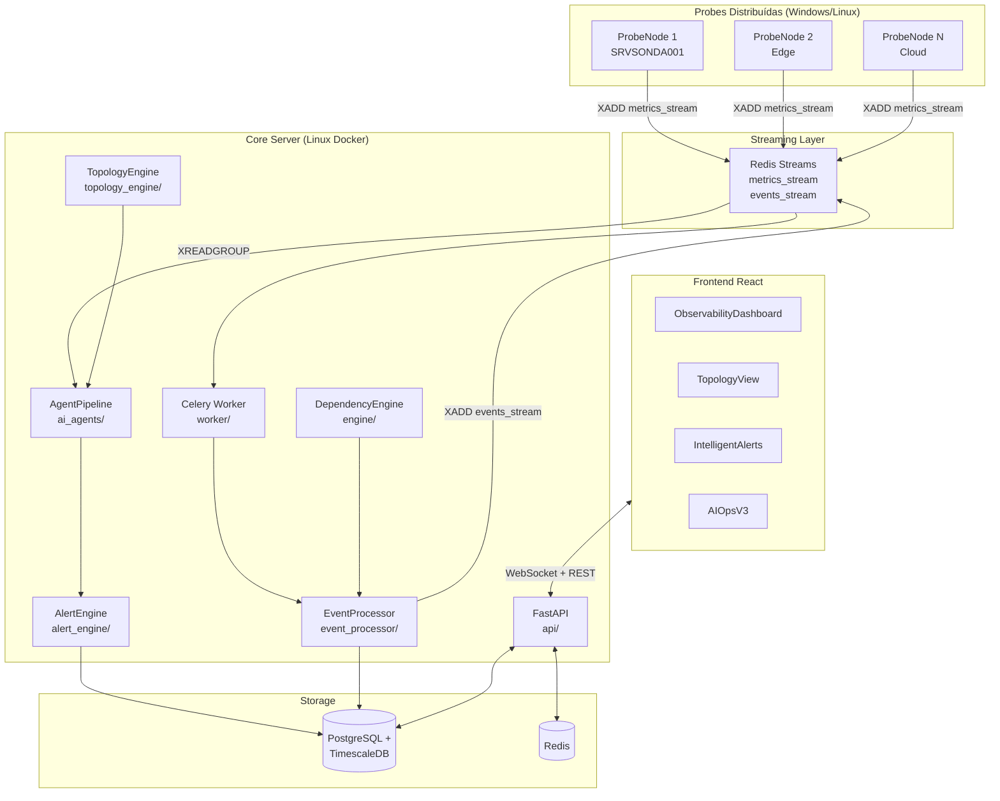
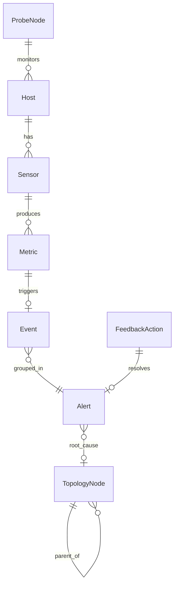

# Design Técnico — Coruja Monitor v3.0

## Overview

O Coruja Monitor v3.0 evolui a plataforma de monitoramento v2.0 para uma solução de observabilidade inteligente comparável ao Datadog e Dynatrace. A arquitetura mantém compatibilidade total com todos os módulos existentes (`wmi_pool.py`, `smart_collector.py`, `global_rate_limiter.py`, `event_queue.py`, `metrics_pipeline/`, `protocol_engines/`, `ai-agent/`) e adiciona 13 fases de novas capacidades.

### Princípios Arquiteturais

- **Compatibilidade retroativa**: nenhum módulo v2.0 é quebrado; novos módulos coexistem
- **Spec Central como fonte única da verdade**: todos os módulos importam de `core/spec/`
- **Separação de responsabilidades**: Metric (dado contínuo) ≠ Event (mudança de estado)
- **Pipeline orientado a eventos**: probe → stream → processor → agentes → alertas
- **Observabilidade do próprio sistema**: métricas de throughput, latência e saúde expostas

### Stack Tecnológica

| Camada | Tecnologia | Justificativa |
|--------|-----------|---------------|
| API | FastAPI (existente) | Mantido; novos routers adicionados |
| Frontend | React (existente) | Novos componentes adicionados incrementalmente |
| Worker | Celery + Redis (existente) | Redis já no docker-compose |
| Banco relacional | PostgreSQL + TimescaleDB (existente) | timescale/timescaledb:2.14.2-pg15 já em uso |
| Streaming | Redis Streams (existente) | Redis já disponível; `stream_producer.py` já usa |
| Grafos | networkx | DAG de dependências e grafo de topologia |
| Property-based testing | hypothesis | Round-trip, idempotência, invariantes DAG |
| Visualização de topologia | react-force-graph | Grafo interativo no frontend |
| Agendamento | APScheduler | Retreinamento de modelos a cada 24h |


---

## Architecture

### Visão Geral do Sistema



### Fluxo de Dados Principal

```
ProbeNode
  → [DependencyEngine: should_execute?]
  → [Protocol Engine: WMI/SNMP/ICMP/TCP]
  → MetricEvent → Redis Stream "metrics_stream"
  → StreamConsumer (XREADGROUP, batch 500)
  → EventProcessor
      → [ThresholdEvaluator: threshold cruzado?]
      → [StateTransition: mudança de status?]
      → Event → Redis Stream "events_stream"
      → TimescaleDB (metrics_ts hypertable)
  → AgentPipeline
      → AnomalyDetectionAgent (Z-score, janela 7d)
      → CorrelationAgent (janela 5min)
      → RootCauseAgent (TopologyGraph)
      → DecisionAgent (severidade + contexto)
      → AutoRemediationAgent (confiança > 85%)
  → AlertEngine
      → DuplicateSuppressor (TTL 5min)
      → EventGrouper (janela 5min)
      → AlertPrioritizer (score ponderado)
      → AlertNotifier (email/webhook/Teams)
  → FeedbackLoop (registro de ações e resultados)
```

### Compatibilidade v2.0

Os módulos existentes continuam funcionando sem modificação:

| Módulo v2.0 | Status v3.0 | Integração |
|-------------|-------------|------------|
| `probe/engine/wmi_pool.py` | Mantido | Usado por `DependencyEngine` via `should_execute()` |
| `probe/engine/smart_collector.py` | Mantido | Continua coletando métricas WMI |
| `probe/engine/global_rate_limiter.py` | Mantido | Continua limitando coletas simultâneas |
| `probe/event_engine/event_queue.py` | Mantido | Coexiste com novo `events_stream` |
| `probe/metrics_pipeline/stream_producer.py` | Estendido | Adiciona `XADD metrics_stream` com batch |
| `probe/metrics_pipeline/stream_consumer.py` | Estendido | Adiciona consumer groups |
| `ai-agent/anomaly_detector.py` | Mantido | Encapsulado em `AnomalyDetectionAgent` |
| `ai-agent/event_correlator.py` | Mantido | Encapsulado em `CorrelationAgent` |
| `ai-agent/root_cause_engine.py` | Mantido | Encapsulado em `RootCauseAgent` |
| `api/routers/probe_nodes.py` | Estendido | `ProbeManager` adicionado ao mesmo router |


---

## Components and Interfaces

### Fase 1 — core/spec/ (Spec Central)

**Responsabilidade**: Fonte única da verdade para todos os tipos de dados do sistema.

```
core/
  spec/
    __init__.py      # exporta todos os modelos e enums
    enums.py         # todos os enums
    models.py        # todos os modelos Pydantic
```

**Interfaces públicas**:

```python
# core/spec/enums.py
from enum import Enum

class HostType(str, Enum):
    SERVER = "server"
    SWITCH = "switch"
    APPLIANCE = "appliance"
    CONTAINER = "container"

class Protocol(str, Enum):
    WMI = "wmi"
    SNMP = "snmp"
    ICMP = "icmp"
    TCP = "tcp"
    HTTP = "http"

class SensorStatus(str, Enum):
    OK = "ok"
    WARNING = "warning"
    CRITICAL = "critical"
    UNKNOWN = "unknown"

class EventSeverity(str, Enum):
    INFO = "info"
    WARNING = "warning"
    CRITICAL = "critical"

class AlertStatus(str, Enum):
    OPEN = "open"
    ACKNOWLEDGED = "acknowledged"
    RESOLVED = "resolved"

class NodeType(str, Enum):
    SWITCH = "switch"
    SERVER = "server"
    SERVICE = "service"
    APPLICATION = "application"

class ProbeStatus(str, Enum):
    ONLINE = "online"
    DEGRADED = "degraded"
    OFFLINE = "offline"
```

```python
# core/spec/models.py
from uuid import UUID, uuid4
from datetime import datetime
from typing import Optional
from pydantic import BaseModel, Field
from .enums import *

class Host(BaseModel):
    id: UUID = Field(default_factory=uuid4)
    hostname: str
    ip_address: str
    type: HostType
    tags: list[str] = []
    metadata: dict = {}
    created_at: datetime = Field(default_factory=datetime.utcnow)

class Sensor(BaseModel):
    id: UUID = Field(default_factory=uuid4)
    host_id: UUID
    type: str
    protocol: Protocol
    interval: int          # segundos
    timeout: int = 30      # segundos
    retries: int = 3
    query: Optional[str] = None
    thresholds: dict = {}  # {"warning": 80, "critical": 95}

class Metric(BaseModel):
    sensor_id: UUID
    host_id: UUID
    value: float
    unit: str
    timestamp: datetime
    status: SensorStatus = SensorStatus.UNKNOWN

class Event(BaseModel):
    id: UUID = Field(default_factory=uuid4)
    host_id: UUID
    type: str
    severity: EventSeverity
    timestamp: datetime
    source_metric_id: Optional[UUID] = None
    description: str = ""

class Alert(BaseModel):
    id: UUID = Field(default_factory=uuid4)
    event_ids: list[UUID] = []
    title: str
    severity: EventSeverity
    status: AlertStatus = AlertStatus.OPEN
    root_cause: Optional[str] = None
    affected_hosts: list[UUID] = []
    created_at: datetime = Field(default_factory=datetime.utcnow)

class TopologyNode(BaseModel):
    id: UUID = Field(default_factory=uuid4)
    type: NodeType
    parent_id: Optional[UUID] = None
    children_ids: list[UUID] = []
    metadata: dict = {}

class ProbeNode(BaseModel):
    id: UUID = Field(default_factory=uuid4)
    name: str
    location: str
    status: ProbeStatus = ProbeStatus.OFFLINE
    capacity: int          # máximo de hosts
    assigned_hosts: list[UUID] = []
```

### Fase 2 — engine/dependency_engine.py

**Responsabilidade**: Controla execução condicional de sensores via DAG de dependências.

```python
# engine/dependency_engine.py
import networkx as nx
from core.spec.enums import SensorStatus

class DependencyEngine:
    def __init__(self):
        self._graph: nx.DiGraph = nx.DiGraph()
        # cache: {host_id: {sensor_id: (SensorStatus, expires_at)}}
        self._state_cache: dict[str, dict[str, tuple]] = {}
        self._cache_ttl: int = 30  # segundos

    def add_dependency(self, parent_sensor_id: str, child_sensor_id: str) -> None:
        """Adiciona aresta parent → child. Rejeita se criar ciclo."""
        ...

    def should_execute(self, sensor_id: str, host_id: str) -> bool:
        """Retorna True se todos os pais estão ok ou sem estado."""
        ...

    def update_state(self, sensor_id: str, host_id: str, status: SensorStatus) -> None:
        """Atualiza cache de estado com TTL 30s."""
        ...

    def get_suspended_sensors(self, host_id: str) -> list[str]:
        """Retorna IDs de sensores suspensos para o host."""
        ...

    def get_graph_status(self) -> dict:
        """Retorna: total_nodes, total_edges, suspended_by_host."""
        ...
```

**Decisão de design**: usar `networkx.DiGraph` para o DAG. Detecção de ciclo via `nx.is_directed_acyclic_graph()` antes de cada `add_edge`. Cache de estado usa `dict` com timestamp de expiração — sem dependência de Redis para manter a probe Windows independente.

### Fase 3 — topology_engine/

**Responsabilidade**: Modela hierarquia de infraestrutura e calcula impacto de falhas.

```python
# topology_engine/graph.py
class TopologyGraph:
    def __init__(self):
        self._graph: nx.DiGraph = nx.DiGraph()

    def add_node(self, node: TopologyNode) -> None: ...
    def add_edge(self, parent_id: str, child_id: str) -> None: ...
    def get_ancestors(self, node_id: str) -> list[str]: ...
    def get_descendants(self, node_id: str) -> list[str]: ...
    def to_dict(self) -> dict:  # formato {nodes: [...], edges: [...]}
        ...

# topology_engine/discovery.py
class SNMPTopologyDiscovery:
    def discover(self, host: str, community: str) -> list[TopologyNode]:
        """Descobre topologia via ARP table e LLDP/CDP."""
        ...

class WMITopologyDiscovery:
    def discover(self, host: str, credential: dict) -> list[TopologyNode]:
        """Descobre serviços e processos via WMI."""
        ...

# topology_engine/impact.py
from dataclasses import dataclass

@dataclass
class BlastRadius:
    node_id: str
    affected_hosts: list[str]
    affected_services: list[str]
    affected_applications: list[str]
    total_impact: int

class ImpactCalculator:
    def __init__(self, graph: TopologyGraph): ...
    def blast_radius(self, node_id: str) -> BlastRadius: ...
```

**API endpoints**:
- `GET /api/v1/topology/nodes` — lista todos os nós
- `GET /api/v1/topology/graph` — grafo completo `{nodes, edges}`
- `GET /api/v1/topology/impact/{node_id}` — `BlastRadius` do nó

### Fase 4 — event_processor/

**Responsabilidade**: Converte Metrics em Events apenas em transições de estado.

```python
# event_processor/threshold_evaluator.py
class ThresholdEvaluator:
    def evaluate(self, metric: Metric, thresholds: dict) -> SensorStatus:
        """Retorna status baseado nos thresholds do sensor."""
        ...

# event_processor/processor.py
class EventProcessor:
    def __init__(self, redis_client, db_session):
        self._last_status: dict[str, SensorStatus] = {}  # {sensor_id: status}
        self._evaluator = ThresholdEvaluator()

    def process(self, metric: Metric) -> Optional[Event]:
        """
        Gera Event apenas em mudança de status.
        Publica em Redis Stream "events_stream" via XADD.
        Persiste Metric em TimescaleDB.
        """
        ...
```

**Decisão de design**: estado anterior por sensor mantido em memória (`_last_status`). Em reinicialização, o estado é reconstruído da última métrica no banco. Publicação no stream via `redis.xadd("events_stream", ...)` com `maxlen=50_000`.

### Fase 5 — ai_agents/

**Responsabilidade**: Pipeline sequencial de agentes de IA especializados.

```python
# ai_agents/base_agent.py
from abc import ABC, abstractmethod
from dataclasses import dataclass

@dataclass
class AgentContext:
    events: list[Event]
    metrics: list[Metric]
    topology: TopologyGraph
    feedback_history: list[dict]

@dataclass
class AgentResult:
    agent_name: str
    success: bool
    output: dict
    error: Optional[str] = None

class BaseAgent(ABC):
    @abstractmethod
    def process(self, context: AgentContext) -> AgentResult: ...

# ai_agents/smart_scheduler.py
class SmartSchedulerAgent(BaseAgent):
    """Ajusta intervalos: 30s em anomalia, restaura após 5 ciclos normais."""
    def process(self, context: AgentContext) -> AgentResult: ...

# ai_agents/anomaly_detection.py
class AnomalyDetectionAgent(BaseAgent):
    """
    Encapsula ai-agent/anomaly_detector.py existente.
    Baseline Z-score: desvio > 3σ gera Event(type=anomaly).
    Janela deslizante: 7 dias.
    """
    def __init__(self):
        from ai_agent.anomaly_detector import AnomalyDetector
        self._detector = AnomalyDetector()
    def process(self, context: AgentContext) -> AgentResult: ...

# ai_agents/correlation.py
class CorrelationAgent(BaseAgent):
    """
    Encapsula ai-agent/event_correlator.py existente.
    Janela de correlação: 5 minutos.
    """
    def process(self, context: AgentContext) -> AgentResult: ...

# ai_agents/root_cause.py
class RootCauseAgent(BaseAgent):
    """
    Encapsula ai-agent/root_cause_engine.py existente.
    Usa TopologyGraph para identificar nó raiz.
    """
    def process(self, context: AgentContext) -> AgentResult: ...

# ai_agents/decision.py
class DecisionAgent(BaseAgent):
    """Decide se eventos correlacionados geram Alert."""
    def process(self, context: AgentContext) -> AgentResult: ...

# ai_agents/auto_remediation.py
class AutoRemediationAgent(BaseAgent):
    """Executa remediação se confiança > 85% e DecisionAgent aprovou."""
    def process(self, context: AgentContext) -> AgentResult: ...

# ai_agents/pipeline.py
class AgentPipeline:
    """
    Orquestra agentes sequencialmente com fallback por agente.
    Ordem: Anomaly → Correlation → RootCause → Decision → Remediation
    """
    def __init__(self, agents: list[BaseAgent]): ...
    def run(self, context: AgentContext) -> list[AgentResult]: ...
```

### Fase 6 — ai_agents/feedback_loop.py

```python
# ai_agents/feedback_loop.py
from dataclasses import dataclass

@dataclass
class RemediationAction:
    agent_name: str
    action_type: str
    target_host: str
    timestamp: datetime

@dataclass
class ActionResult:
    success: bool
    resolution_time_seconds: float

@dataclass
class FeedbackMetrics:
    actions_total: int
    actions_successful: int
    mean_resolution_time_seconds: float
    false_positive_rate: float

class FeedbackLoop:
    def record_action(self, action: RemediationAction) -> str:
        """Persiste ação na tabela ai_feedback_actions. Retorna action_id."""
        ...
    def record_result(self, action_id: str, result: ActionResult) -> None:
        """Atualiza resultado e ajusta peso da ação no modelo."""
        ...
    def get_metrics(self) -> FeedbackMetrics: ...
```

**Tabela DB**: `ai_feedback_actions` com campos: `action_id` (UUID PK), `agent_name`, `action_type`, `target_host`, `timestamp`, `result` (success/failure/partial), `resolution_time_seconds`, `outcome` (positive/negative).

### Fase 7 — ai_agents/root_cause_engine.py (v3)

```python
# ai_agents/root_cause_engine.py (novo, não substitui ai-agent/root_cause_engine.py)
@dataclass
class RootCauseResult:
    root_node_id: str
    confidence: float
    affected_nodes: list[str]
    affected_nodes_count: int
    estimated_impact: dict  # {services: [...], applications: [...]}
    reasoning: str

class RootCauseEngine:
    def analyze(
        self,
        events: list[Event],
        topology: TopologyGraph
    ) -> RootCauseResult:
        """
        Algoritmo:
        1. Agrupar eventos por TopologyNode pai (via topology.get_ancestors)
        2. Ordenar por timestamp (mais antigo primeiro)
        3. Nó pai com mais descendentes afetados = causa raiz candidata
        4. confidence = affected_descendants / total_descendants
        """
        ...
```

### Fase 8 — alert_engine/

```python
# alert_engine/suppressor.py
class DuplicateSuppressor:
    """Cache Redis com TTL 5min. Chave: hash(host_id + type + severity)."""
    def is_duplicate(self, event: Event) -> bool: ...
    def mark_seen(self, event: Event) -> None: ...

# alert_engine/grouper.py
class EventGrouper:
    """Agrupa eventos do mesmo host em janela de 5 minutos."""
    def group(self, events: list[Event]) -> list[list[Event]]: ...

# alert_engine/prioritizer.py
class AlertPrioritizer:
    """
    Score ponderado:
      severidade × 0.40
      + hosts_afetados × 0.30
      + impacto_servicos_criticos × 0.20
      + horario_negocio × 0.10
    """
    def score(self, alert: Alert, context: dict) -> float: ...

# alert_engine/notifier.py
class AlertNotifier:
    def notify(self, alert: Alert, channels: list[str]) -> None:
        """Suporta: email, webhook, Teams. SLA: < 30s."""
        ...

# alert_engine/engine.py
class AlertEngine:
    def __init__(self, suppressor, grouper, prioritizer, notifier): ...
    def process_events(self, events: list[Event]) -> list[Alert]: ...
```

### Fase 9 — Frontend v3 (React)

Novos componentes adicionados incrementalmente, sem remover os existentes:

| Componente | Rota | Descrição |
|-----------|------|-----------|
| `ObservabilityDashboard.js` | `/observability` | Health score, mapa de impacto, alertas críticos |
| `TopologyView.js` | `/topology` | Grafo interativo com `react-force-graph` |
| `IntelligentAlerts.js` | `/alerts/intelligent` | Causa raiz, hosts afetados, timeline |
| `AIOpsV3.js` | `/aiops/v3` | Anomalias, previsões, ações automáticas |
| `AdvancedMetrics.js` | `/metrics/advanced` | Zoom, comparação, correlação |
| `EventsTimeline.js` | `/events/timeline` | Timeline com filtros avançados |

**Novos endpoints API**:
- `GET /api/v1/observability/health-score`
- `GET /api/v1/observability/impact-map`
- `GET /api/v1/topology/nodes`
- `GET /api/v1/topology/graph`
- `GET /api/v1/topology/impact/{node_id}`
- `GET /api/v1/alerts/intelligent`
- `GET /api/v1/alerts/intelligent/{alert_id}/root-cause`
- `WS /api/v1/ws/observability` — atualizações em tempo real (< 5s)

### Fase 10 — sensor_dsl/

```python
# sensor_dsl/ast_nodes.py
from dataclasses import dataclass, field

@dataclass
class FieldNode:
    name: str
    value: str | int | float

@dataclass
class SensorNode:
    name: str
    fields: list[FieldNode] = field(default_factory=list)
    extends: str | None = None

# sensor_dsl/lexer.py
# Tokens: SENSOR, STRING, LBRACE, RBRACE, EQUALS, NUMBER, IDENTIFIER,
#         COMMENT_LINE (#), COMMENT_BLOCK (/* */), EXTENDS, HASH
class Lexer:
    def tokenize(self, source: str) -> list[Token]: ...

# sensor_dsl/parser.py
class Parser:
    """Recursivo descendente. Produz lista de SensorNode."""
    def parse(self, tokens: list[Token]) -> list[SensorNode]: ...

# sensor_dsl/compiler.py
class DSLCompiler:
    def compile(self, source: str) -> list[Sensor]:
        """Lexer → Parser → SensorNode → Sensor (Pydantic)."""
        ...

# sensor_dsl/printer.py
class DSLPrinter:
    def print(self, sensor: Sensor) -> str:
        """Sensor → DSL string formatada."""
        ...
```

**Gramática BNF**:
```
program     ::= sensor_def*
sensor_def  ::= 'sensor' STRING ('extends' STRING)? '{' field* '}'
field       ::= IDENTIFIER '=' (STRING | NUMBER)
```

### Fase 11 — Distributed Probes

```python
# api/routers/probe_manager.py
class ProbeManager:
    """
    Balanceamento: weighted round-robin por capacidade + afinidade de subnet.
    Failover: heartbeat monitor thread, redistribuição em 120s.
    """
    def assign_host(self, host: Host) -> ProbeNode:
        """Seleciona probe com menor carga relativa na mesma subnet."""
        ...
    def handle_probe_offline(self, probe_id: str) -> None:
        """Redistribui hosts para probes disponíveis do mesmo tipo."""
        ...
    def restore_probe(self, probe_id: str) -> None:
        """Restaura hosts gradualmente em 300s para evitar pico."""
        ...
```

**Algoritmo de balanceamento**:
1. Filtrar probes `online` na mesma subnet (afinidade)
2. Calcular `load = assigned_hosts / capacity` para cada probe
3. Selecionar probe com menor `load` (weighted round-robin)
4. Se nenhuma probe na mesma subnet, usar qualquer probe com `load < 0.80`

### Fase 12 — Streaming Architecture

**Extensão do pipeline existente** (`probe/metrics_pipeline/`):

```python
# probe/metrics_pipeline/stream_producer.py (estendido)
# Adiciona: batch publish, XADD metrics_stream, buffer local 10k métricas

# probe/metrics_pipeline/stream_consumer.py (estendido)
# Adiciona: consumer groups (XREADGROUP), múltiplos consumidores paralelos

# probe/metrics_pipeline/metrics_processor.py (estendido)
# Adiciona: batch insert TimescaleDB (500 métricas/batch)
```

**TimescaleDB**:
```sql
-- Hypertable para métricas (chunk por 1 dia)
CREATE TABLE metrics_ts (
    time        TIMESTAMPTZ NOT NULL,
    sensor_id   UUID NOT NULL,
    host_id     UUID NOT NULL,
    value       DOUBLE PRECISION NOT NULL,
    unit        TEXT,
    status      TEXT
);
SELECT create_hypertable('metrics_ts', 'time');

-- Retention policy: 90 dias
SELECT add_retention_policy('metrics_ts', INTERVAL '90 days');

-- Compressão após 7 dias
ALTER TABLE metrics_ts SET (
    timescaledb.compress,
    timescaledb.compress_segmentby = 'sensor_id'
);
SELECT add_compression_policy('metrics_ts', INTERVAL '7 days');
```

**Configuração Redis** (`.env`):
```
REDIS_URL=redis://localhost:6379/0
METRICS_STREAM_KEY=metrics_stream
EVENTS_STREAM_KEY=events_stream
STREAM_CONSUMER_GROUP=coruja-consumers
STREAM_BATCH_SIZE=500
```


---

## Data Models

### Estrutura de Diretórios Nova

```
core/
  spec/
    __init__.py
    models.py
    enums.py

engine/
  dependency_engine.py

topology_engine/
  __init__.py
  graph.py
  discovery.py
  impact.py

event_processor/
  __init__.py
  processor.py
  threshold_evaluator.py

ai_agents/
  __init__.py
  base_agent.py
  smart_scheduler.py
  anomaly_detection.py
  correlation.py
  root_cause.py
  decision.py
  auto_remediation.py
  pipeline.py
  feedback_loop.py
  root_cause_engine.py

alert_engine/
  __init__.py
  engine.py
  suppressor.py
  grouper.py
  prioritizer.py
  notifier.py

sensor_dsl/
  __init__.py
  lexer.py
  parser.py
  ast_nodes.py
  compiler.py
  printer.py

tests/
  test_dependency_engine.py
  test_topology_engine.py
  test_event_processor.py
  test_alert_engine.py
  test_ai_agents.py
  test_sensor_dsl.py
  test_load_simulation.py
  test_pbt_properties.py
```

### Tabelas de Banco de Dados Novas

```sql
-- Tabela de feedback de ações de IA
CREATE TABLE ai_feedback_actions (
    action_id           UUID PRIMARY KEY DEFAULT gen_random_uuid(),
    agent_name          TEXT NOT NULL,
    action_type         TEXT NOT NULL,
    target_host         TEXT NOT NULL,
    timestamp           TIMESTAMPTZ NOT NULL DEFAULT NOW(),
    result              TEXT CHECK (result IN ('success', 'failure', 'partial')),
    resolution_time_seconds FLOAT,
    outcome             TEXT CHECK (outcome IN ('positive', 'negative', 'pending')),
    metadata            JSONB
);
CREATE INDEX idx_feedback_agent ON ai_feedback_actions(agent_name);
CREATE INDEX idx_feedback_timestamp ON ai_feedback_actions(timestamp);

-- Tabela de nós de topologia
CREATE TABLE topology_nodes (
    id          UUID PRIMARY KEY DEFAULT gen_random_uuid(),
    type        TEXT NOT NULL,
    parent_id   UUID REFERENCES topology_nodes(id),
    metadata    JSONB DEFAULT '{}',
    created_at  TIMESTAMPTZ DEFAULT NOW(),
    updated_at  TIMESTAMPTZ DEFAULT NOW()
);

-- Tabela de alertas inteligentes v3
CREATE TABLE intelligent_alerts (
    id              UUID PRIMARY KEY DEFAULT gen_random_uuid(),
    event_ids       UUID[] NOT NULL DEFAULT '{}',
    title           TEXT NOT NULL,
    severity        TEXT NOT NULL,
    status          TEXT NOT NULL DEFAULT 'open',
    root_cause      TEXT,
    affected_hosts  UUID[] DEFAULT '{}',
    root_cause_node UUID REFERENCES topology_nodes(id),
    confidence      FLOAT,
    created_at      TIMESTAMPTZ DEFAULT NOW(),
    resolved_at     TIMESTAMPTZ
);
CREATE INDEX idx_alerts_status ON intelligent_alerts(status);
CREATE INDEX idx_alerts_severity ON intelligent_alerts(severity);
CREATE INDEX idx_alerts_created ON intelligent_alerts(created_at);
```

### Relacionamento entre Modelos




---

## Correctness Properties

*A property is a characteristic or behavior that should hold true across all valid executions of a system — essentially, a formal statement about what the system should do. Properties serve as the bridge between human-readable specifications and machine-verifiable correctness guarantees.*

**Reflexão de redundância**: Após análise dos critérios de aceitação, as seguintes consolidações foram feitas:
- 2.2 e 2.3 (suspensão/reativação de sensores) são combinados em uma propriedade de round-trip
- 5.3 (anomalia > 3σ) e 5.5 (RootCause usa topologia) são propriedades independentes mantidas
- 7.2, 7.3, 7.4 (RootCause) são consolidados em duas propriedades (confiança e consolidação)
- 8.1 e 8.2 (supressão e agrupamento) são propriedades independentes mantidas
- 10.4 e 10.5 (DSL válido/inválido) são mantidas como propriedades complementares
- 12.3 e 12.4 (batch e at-least-once) são mantidas como propriedades independentes

---

### Property 1: Round-trip de serialização dos modelos Pydantic

*For any* instância válida de qualquer modelo do Spec_Central (Host, Sensor, Metric, Event, Alert, TopologyNode, ProbeNode), serializar para JSON e desserializar de volta deve produzir um objeto equivalente ao original.

**Validates: Requirements 1.11**

---

### Property 2: Validação de campos obrigatórios rejeita entradas inválidas

*For any* tentativa de instanciar um modelo do Spec_Central com campos obrigatórios ausentes ou com tipos incorretos, o sistema deve lançar `ValidationError` e nunca criar um objeto parcialmente válido.

**Validates: Requirements 1.2**

---

### Property 3: DAG nunca contém ciclos após operações de adição

*For any* sequência de chamadas a `add_dependency()` que não introduzam ciclos, o grafo resultante deve sempre ser um DAG válido (`nx.is_directed_acyclic_graph() == True`). Para qualquer sequência que introduza um ciclo, `add_dependency()` deve rejeitar a operação com erro.

**Validates: Requirements 2.1, 2.6**

---

### Property 4: Suspensão e reativação de sensores filhos (round-trip)

*For any* DAG de dependências e qualquer sensor pai, definir o status do pai como `critical` deve fazer `should_execute()` retornar `False` para todos os filhos diretos e indiretos; subsequentemente definir o status do pai como `ok` deve restaurar `should_execute()` para `True` para todos os filhos.

**Validates: Requirements 2.2, 2.3**

---

### Property 5: Blast radius inclui todos os descendentes

*For any* grafo de topologia e qualquer nó, `blast_radius(node_id).total_impact` deve ser igual ao número de descendentes do nó no grafo (`len(nx.descendants(graph, node_id))`).

**Validates: Requirements 3.4, 3.5**

---

### Property 6: Round-trip de persistência do grafo de topologia

*For any* `TopologyGraph` com N nós e M arestas, salvar no banco e recarregar deve produzir um grafo com o mesmo número de nós, arestas e relações pai-filho.

**Validates: Requirements 3.6**

---

### Property 7: EventProcessor gera Event apenas em transição de estado (idempotência)

*For any* sequência de métricas com o mesmo status (ex: dois `critical` consecutivos do mesmo sensor), `EventProcessor.process()` deve gerar Event apenas na primeira ocorrência (transição ok→critical) e retornar `None` nas ocorrências subsequentes com o mesmo status.

**Validates: Requirements 4.2, 4.3**

---

### Property 8: Anomalia detectada quando valor desvia > 3σ do baseline

*For any* sensor com baseline estabelecido (média μ e desvio padrão σ calculados sobre janela de 7 dias), qualquer valor `v` tal que `|v - μ| > 3σ` deve resultar em `AnomalyDetectionAgent` gerando um `Event(type="anomaly")` com `confidence_score > 0`.

**Validates: Requirements 5.3**

---

### Property 9: Pipeline de agentes continua após falha de agente individual

*For any* `AgentPipeline` com N agentes onde o agente na posição K lança uma exceção, os agentes nas posições K+1 até N devem ainda ser executados, e o resultado final deve conter N resultados (com o resultado K marcado como `success=False`).

**Validates: Requirements 5.10**

---

### Property 10: AutoRemediationAgent só executa com confiança ≥ 85%

*For any* `AgentContext` onde `DecisionAgent` retorna `confidence < 0.85`, `AutoRemediationAgent.process()` não deve executar nenhuma ação de remediação. Para `confidence >= 0.85`, deve executar e registrar a ação.

**Validates: Requirements 5.7**

---

### Property 11: Feedback Loop classifica outcome por tempo de resolução

*For any* `RemediationAction` com `resolution_time_seconds < 300`, `FeedbackLoop.record_result()` deve registrar `outcome = "positive"`. Para `resolution_time_seconds >= 300`, deve registrar `outcome = "negative"`.

**Validates: Requirements 6.3, 6.4**

---

### Property 12: RootCause identifica nó pai com confiança ≥ 0.8 quando múltiplos filhos falham

*For any* topologia onde N ≥ 2 hosts filhos de um mesmo nó pai ficam offline simultaneamente, `RootCauseEngine.analyze()` deve identificar o nó pai como causa raiz com `confidence >= 0.8`.

**Validates: Requirements 7.2, 7.3**

---

### Property 13: RootCause gera exatamente um Alert consolidado por grupo correlacionado

*For any* grupo de eventos correlacionados com causa raiz identificada, `AlertEngine.process_events()` deve gerar exatamente um `Alert` (não N alertas individuais), com `affected_hosts` contendo todos os hosts do grupo.

**Validates: Requirements 7.4, 8.2**

---

### Property 14: DuplicateSuppressor impede criação de alertas duplicados (idempotência)

*For any* `Alert` com status `open`, processar um segundo `Event` com o mesmo `(host_id, type, severity)` deve retornar o alerta existente sem criar um novo. O número total de alertas abertos para aquele host+tipo+severidade deve permanecer 1.

**Validates: Requirements 8.1**

---

### Property 15: Score de prioridade de alerta respeita fórmula ponderada

*For any* `Alert`, o score calculado por `AlertPrioritizer.score()` deve satisfazer: `score = severidade × 0.40 + hosts_afetados_normalizado × 0.30 + impacto_critico × 0.20 + horario_negocio × 0.10`, com todos os fatores no intervalo [0, 1].

**Validates: Requirements 8.3**

---

### Property 16: Flood protection agrupa eventos excessivos em único alerta

*For any* host que gere mais de 100 eventos em menos de 60 segundos, `AlertEngine.process_events()` deve ativar flood protection e produzir exatamente 1 alerta de alta prioridade (não mais de 100 alertas individuais).

**Validates: Requirements 8.8**

---

### Property 17: Alertas suprimidos durante janela de manutenção

*For any* host em janela de manutenção ativa, `AlertEngine.process_events()` não deve gerar nenhum `Alert` para aquele host, independentemente da severidade dos eventos.

**Validates: Requirements 8.5**

---

### Property 18: DSL round-trip (parse → print → parse)

*For any* objeto `Sensor` válido do Spec_Central, `DSLPrinter.print(sensor)` seguido de `DSLCompiler.compile(dsl_string)` deve produzir um `Sensor` equivalente ao original (mesmos valores de todos os campos).

**Validates: Requirements 10.7**

---

### Property 19: DSL rejeita protocolos inválidos com erro descritivo

*For any* string DSL contendo um valor de `protocol` não pertencente ao enum `Protocol` (wmi/snmp/icmp/tcp/http), `DSLCompiler.compile()` deve lançar erro com número de linha e nome do campo inválido.

**Validates: Requirements 10.5, 10.9**

---

### Property 20: Cada host é monitorado por exatamente uma ProbeNode ativa

*For any* estado de atribuição de hosts no `ProbeManager`, cada `host_id` deve aparecer na lista `assigned_hosts` de exatamente uma `ProbeNode` com status `online`. Nenhum host deve aparecer em zero ou mais de uma probe simultaneamente.

**Validates: Requirements 11.6**

---

### Property 21: Balanceamento de carga respeita capacidade máxima de 80%

*For any* conjunto de probes disponíveis, `ProbeManager.assign_host()` nunca deve atribuir um host a uma probe cuja carga resultante (`assigned_hosts / capacity`) exceda 0.80, desde que exista pelo menos uma probe com carga abaixo desse limite.

**Validates: Requirements 11.2, 11.8**

---

### Property 22: Stream consumer processa em batches de no máximo 500 métricas

*For any* chamada ao `StreamConsumer`, o número de métricas passadas para `on_batch()` em uma única invocação nunca deve exceder 500.

**Validates: Requirements 12.3**

---

### Property 23: At-least-once delivery — métricas não-ACKed são reprocessadas

*For any* conjunto de métricas publicadas no Redis Stream que não foram ACKed (simulando falha do consumer), após reinicialização do consumer, todas as mensagens pendentes devem ser reprocessadas via `XREADGROUP` com `id="0"` (pending entries).

**Validates: Requirements 12.4**


---

## Error Handling

### Estratégia Geral

| Camada | Tipo de Erro | Estratégia |
|--------|-------------|------------|
| Spec Central | `ValidationError` Pydantic | Propagar para o chamador com mensagem descritiva |
| DependencyEngine | Ciclo detectado | `ValueError` com descrição do ciclo |
| TopologyEngine | Nó não encontrado | `KeyError` com node_id |
| EventProcessor | Redis indisponível | Fallback para fila em memória (já implementado em `stream_producer.py`) |
| AgentPipeline | Agente falha | Log do erro, continua pipeline com `AgentResult(success=False)` |
| AlertEngine | Notificação falha | Retry 3x com backoff exponencial; log se todas falharem |
| DSL Compiler | Sintaxe inválida | `DSLSyntaxError` com `line`, `column`, `field`, `message` |
| ProbeManager | Nenhuma probe disponível | `NoProbeAvailableError`; host entra em fila de espera |
| StreamConsumer | Mensagem malformada | Log warning, ACK a mensagem (evita loop infinito), continua |

### Tratamento de Falhas de Conectividade

```python
# Hierarquia de fallback para coleta de métricas
# 1. Redis Stream disponível → XADD metrics_stream
# 2. Redis indisponível → buffer em memória (deque maxlen=10_000)
# 3. Buffer cheio → log WARNING, descarta métricas mais antigas (FIFO)
# 4. Reconexão Redis → drena buffer em memória para o stream
```

### Proteção contra Lockout AD (WMI)

O `WMIConnectionPool` existente já implementa backoff após falhas de autenticação:
- 3 falhas → backoff 10 minutos
- Mais de 3 falhas → backoff 30 minutos
- `DependencyEngine` complementa: se Ping falhar, WMI não é tentado

### Circuit Breaker para Agentes de IA

```python
# ai_agents/pipeline.py
# Se um agente falhar em > 50% das últimas 10 execuções:
#   → agente entra em "circuit open" por 5 minutos
#   → pipeline pula o agente e continua
#   → após 5 minutos, tenta novamente ("half-open")
```

---

## Testing Strategy

### Abordagem Dual: Testes Unitários + Property-Based Testing

Os dois tipos são complementares e ambos obrigatórios:
- **Testes unitários**: exemplos específicos, casos de borda, integrações
- **Testes de propriedade**: validação universal com entradas geradas aleatoriamente

### Biblioteca de Property-Based Testing

**Biblioteca escolhida**: `hypothesis` (Python)

Justificativa: integração nativa com pytest, suporte a estratégias customizadas para modelos Pydantic, shrinking automático de contraexemplos, e compatibilidade com o stack existente.

```bash
pip install hypothesis pytest-benchmark
```

### Configuração dos Testes de Propriedade

```python
# tests/test_pbt_properties.py
from hypothesis import given, settings, HealthCheck
from hypothesis import strategies as st

# Mínimo 100 iterações por propriedade (devido à aleatoriedade)
settings.register_profile("ci", max_examples=100)
settings.register_profile("thorough", max_examples=500)
settings.load_profile("ci")
```

### Mapeamento Propriedade → Teste

| Property | Arquivo de Teste | Tag |
|----------|-----------------|-----|
| Property 1 | `test_pbt_properties.py` | `Feature: coruja-monitor-v3, Property 1: round-trip serialização Pydantic` |
| Property 2 | `test_pbt_properties.py` | `Feature: coruja-monitor-v3, Property 2: validação campos obrigatórios` |
| Property 3 | `test_dependency_engine.py` | `Feature: coruja-monitor-v3, Property 3: DAG sem ciclos` |
| Property 4 | `test_dependency_engine.py` | `Feature: coruja-monitor-v3, Property 4: suspensão/reativação round-trip` |
| Property 5 | `test_topology_engine.py` | `Feature: coruja-monitor-v3, Property 5: blast radius = descendentes` |
| Property 6 | `test_topology_engine.py` | `Feature: coruja-monitor-v3, Property 6: round-trip persistência grafo` |
| Property 7 | `test_event_processor.py` | `Feature: coruja-monitor-v3, Property 7: idempotência EventProcessor` |
| Property 8 | `test_ai_agents.py` | `Feature: coruja-monitor-v3, Property 8: anomalia > 3σ` |
| Property 9 | `test_ai_agents.py` | `Feature: coruja-monitor-v3, Property 9: pipeline continua após falha` |
| Property 10 | `test_ai_agents.py` | `Feature: coruja-monitor-v3, Property 10: remediação só com confiança ≥ 85%` |
| Property 11 | `test_ai_agents.py` | `Feature: coruja-monitor-v3, Property 11: feedback outcome por tempo` |
| Property 12 | `test_ai_agents.py` | `Feature: coruja-monitor-v3, Property 12: RootCause confiança ≥ 0.8` |
| Property 13 | `test_alert_engine.py` | `Feature: coruja-monitor-v3, Property 13: alerta consolidado único` |
| Property 14 | `test_alert_engine.py` | `Feature: coruja-monitor-v3, Property 14: supressão de duplicados` |
| Property 15 | `test_alert_engine.py` | `Feature: coruja-monitor-v3, Property 15: score ponderado` |
| Property 16 | `test_alert_engine.py` | `Feature: coruja-monitor-v3, Property 16: flood protection` |
| Property 17 | `test_alert_engine.py` | `Feature: coruja-monitor-v3, Property 17: supressão em manutenção` |
| Property 18 | `test_sensor_dsl.py` | `Feature: coruja-monitor-v3, Property 18: DSL round-trip` |
| Property 19 | `test_sensor_dsl.py` | `Feature: coruja-monitor-v3, Property 19: DSL rejeita protocolo inválido` |
| Property 20 | `test_load_simulation.py` | `Feature: coruja-monitor-v3, Property 20: host em exatamente uma probe` |
| Property 21 | `test_load_simulation.py` | `Feature: coruja-monitor-v3, Property 21: carga máxima 80%` |
| Property 22 | `test_pbt_properties.py` | `Feature: coruja-monitor-v3, Property 22: batch ≤ 500 métricas` |
| Property 23 | `test_pbt_properties.py` | `Feature: coruja-monitor-v3, Property 23: at-least-once delivery` |

### Estrutura dos Arquivos de Teste

```python
# tests/test_dependency_engine.py
# - test_dag_rejects_cycle: Property 3
# - test_suspension_roundtrip: Property 4
# - test_cache_ttl_expiry: edge case (TTL 30s)
# - test_cascade_dependencies: edge case (Ping → TCP → WMI)
# - test_graph_status_endpoint: example

# tests/test_topology_engine.py
# - test_blast_radius_equals_descendants: Property 5
# - test_graph_persistence_roundtrip: Property 6
# - test_hierarchy_switch_server_service: example
# - test_manual_customization_preserved: example

# tests/test_event_processor.py
# - test_idempotency_same_status: Property 7
# - test_threshold_generates_event: Property 7 (transition case)
# - test_dynamic_thresholds: edge case
# - test_timescaledb_persistence: example

# tests/test_alert_engine.py
# - test_duplicate_suppression: Property 14
# - test_event_grouping_5min_window: Property 13
# - test_priority_score_formula: Property 15
# - test_flood_protection: Property 16
# - test_maintenance_window_suppression: Property 17
# - test_consolidated_alert_single: Property 13
# - test_escalation_after_15min: example

# tests/test_ai_agents.py
# - test_anomaly_3sigma: Property 8
# - test_pipeline_continues_after_failure: Property 9
# - test_remediation_confidence_threshold: Property 10
# - test_feedback_outcome_classification: Property 11
# - test_root_cause_confidence_multiple_hosts: Property 12
# - test_smart_scheduler_interval_adjustment: example

# tests/test_sensor_dsl.py
# - test_dsl_roundtrip: Property 18
# - test_invalid_protocol_rejected: Property 19
# - test_valid_dsl_parses_to_sensor: example
# - test_comments_ignored: edge case
# - test_template_inheritance: edge case

# tests/test_load_simulation.py
# - test_1000_hosts_50_sensors_throughput: 1000×50 = 50k sensores
#   → latência média < 2s, sem perda de dados (pytest-benchmark)
# - test_probe_assignment_invariant: Property 20
# - test_probe_load_balance_80pct: Property 21

# tests/test_pbt_properties.py
# - test_pydantic_roundtrip_all_models: Property 1
# - test_pydantic_validation_rejects_invalid: Property 2
# - test_stream_batch_size_limit: Property 22
# - test_atleast_once_delivery: Property 23
```

### Testes de Regressão v2.0

```python
# tests/test_regression_v2.py
# Garante que módulos existentes continuam funcionando:
# - test_wmi_pool_acquire_release
# - test_smart_collector_collect_all
# - test_global_rate_limiter_slots
# - test_event_queue_enqueue_dequeue
# - test_stream_producer_publish_fallback
```

### Cobertura Mínima

Meta: 80% de linhas nos módulos: `core/spec/`, `engine/dependency_engine.py`, `topology_engine/`, `event_processor/`, `ai_agents/`, `alert_engine/`.

```bash
# Executar testes com cobertura
pytest tests/ --cov=core --cov=engine --cov=topology_engine \
       --cov=event_processor --cov=ai_agents --cov=alert_engine \
       --cov-report=term-missing --cov-fail-under=80

# Testes de carga (single run, não watch mode)
pytest tests/test_load_simulation.py --benchmark-only --benchmark-min-rounds=3
```

