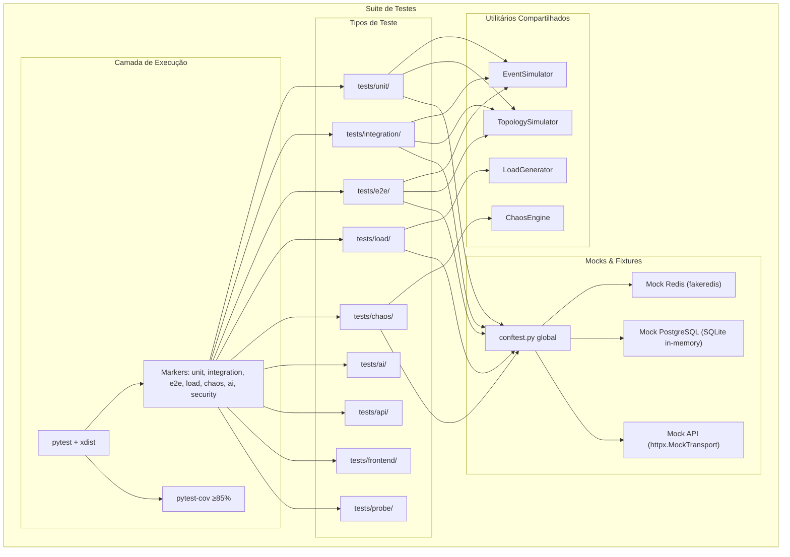

# Design — Suite de Testes Completa Coruja Monitor v3.0

## Visão Geral

Este documento descreve o design da suite de testes abrangente para o Coruja Monitor v3.0. A suite expande os 349 testes existentes para cobrir todos os 11 módulos do sistema com 9 tipos de teste, atingindo cobertura ≥85% nos módulos críticos. O design organiza testes por tipo e módulo, introduz utilitários compartilhados de simulação (EventSimulator, TopologySimulator, LoadGenerator, ChaosEngine), define estratégia de mocks para dependências externas, e estabelece propriedades de corretude verificáveis via Hypothesis.

### Decisões de Design

1. **Estrutura hierárquica por tipo de teste**: Diretórios `tests/unit/`, `tests/integration/`, `tests/e2e/`, `tests/load/`, `tests/chaos/`, `tests/ai/`, `tests/frontend/`, `tests/api/`, `tests/probe/` permitem execução isolada por tipo via markers do pytest.
2. **Utilitários em `tests/utils/`**: Simuladores compartilhados evitam duplicação de código entre testes de diferentes tipos.
3. **Mocks centralizados em `tests/conftest.py`**: Fixtures globais para Redis, PostgreSQL e API HTTP garantem isolamento e reprodutibilidade.
4. **Hypothesis como biblioteca PBT**: Já utilizada no projeto (6.x), com perfis `ci` (100 exemplos) e `thorough` (500 exemplos).
5. **pytest-xdist para paralelismo**: Execução paralela com isolamento de estado via fixtures `function`-scoped.
6. **Cobertura via pytest-cov**: Configuração com `--cov-fail-under=85` nos módulos críticos.

## Arquitetura



### Estrutura de Diretórios

```
tests/
├── conftest.py                    # Fixtures globais (mocks Redis, DB, API)
├── pytest.ini                     # Configuração pytest (markers, xdist)
├── __init__.py
│
├── utils/                         # Utilitários compartilhados
│   ├── __init__.py
│   ├── event_simulator.py         # Gerador de eventos sintéticos
│   ├── topology_simulator.py      # Criador de topologias simuladas
│   ├── load_generator.py          # Simulador de carga (1000 hosts × 50 sensores)
│   ├── chaos_engine.py            # Simulador de falhas de infraestrutura
│   └── hypothesis_strategies.py   # Strategies Hypothesis reutilizáveis
│
├── unit/                          # Testes unitários por módulo
│   ├── conftest.py
│   ├── test_probe_collectors.py
│   ├── test_dependency_engine.py
│   ├── test_event_processor.py
│   ├── test_ai_pipeline.py
│   ├── test_alert_engine.py
│   ├── test_topology_engine.py
│   ├── test_sensor_dsl.py
│   └── test_streaming_redis.py
│
├── integration/                   # Testes de integração cross-module
│   ├── conftest.py
│   ├── test_metric_to_alert_flow.py
│   ├── test_host_down_scenario.py
│   ├── test_cascade_failure.py
│   └── test_ai_decision_flow.py
│
├── e2e/                           # Cenários críticos obrigatórios
│   ├── conftest.py
│   ├── test_host_down.py
│   ├── test_redis_offline.py
│   ├── test_event_flood.py
│   ├── test_cascade_failure.py
│   ├── test_high_load.py
│   ├── test_ai_decision.py
│   └── test_websocket_drop.py
│
├── load/                          # Testes de carga e performance
│   ├── conftest.py
│   ├── test_throughput.py
│   └── test_api_latency.py
│
├── chaos/                         # Chaos engineering
│   ├── conftest.py
│   ├── test_redis_failure.py
│   ├── test_network_latency.py
│   ├── test_packet_loss.py
│   └── test_event_flood_chaos.py
│
├── ai/                            # Testes específicos de IA
│   ├── conftest.py
│   ├── test_anomaly_detection.py
│   ├── test_correlation.py
│   ├── test_root_cause.py
│   ├── test_feedback_loop.py
│   └── test_circuit_breaker.py
│
├── api/                           # Testes da API FastAPI
│   ├── conftest.py
│   ├── test_endpoints_v3.py
│   ├── test_endpoints_v2.py
│   ├── test_auth.py
│   ├── test_websocket.py
│   └── test_validation.py
│
├── security/                      # Testes de segurança
│   ├── test_auth_enforcement.py
│   ├── test_credential_encryption.py
│   ├── test_waf.py
│   └── test_token_expiry.py
│
├── frontend/                      # Testes do frontend React
│   ├── test_dashboard_render.py
│   ├── test_noc_mode.py
│   └── test_websocket_reconnect.py
│
├── probe/                         # Testes específicos da sonda
│   ├── test_collectors.py
│   ├── test_connection_pools.py
│   ├── test_rate_limiter.py
│   ├── test_buffer_offline.py
│   └── test_orchestrator.py
│
├── database/                      # Testes do TimescaleDB
│   ├── test_hypertable.py
│   ├── test_retention.py
│   ├── test_compression.py
│   └── test_query_performance.py
│
├── pbt/                           # Testes property-based (Hypothesis)
│   ├── conftest.py
│   ├── test_pbt_models.py
│   ├── test_pbt_dag.py
│   ├── test_pbt_event_processor.py
│   ├── test_pbt_alert_engine.py
│   ├── test_pbt_topology.py
│   ├── test_pbt_sensor_dsl.py
│   └── test_pbt_ai_pipeline.py
│
└── report/                        # Relatório automatizado
    ├── __init__.py
    ├── metrics_collector.py
    └── report_generator.py
```

## Componentes e Interfaces

### 1. EventSimulator (`tests/utils/event_simulator.py`)

Gera eventos sintéticos para testes de integração e carga.

```python
class EventSimulator:
    def generate_metric(self, host_id, sensor_type, value, status) -> Metric
    def generate_event(self, host_id, event_type, severity) -> Event
    def generate_metric_stream(self, host_id, count, interval_ms) -> list[Metric]
    def generate_state_transitions(self, host_id, transitions) -> list[Metric]
    def generate_flood(self, host_id, count, window_seconds) -> list[Event]
```

### 2. TopologySimulator (`tests/utils/topology_simulator.py`)

Cria topologias de infraestrutura simuladas.

```python
class TopologySimulator:
    def create_simple_topology(self, switches, servers_per_switch, services_per_server) -> TopologyGraph
    def create_datacenter_topology(self, racks, servers_per_rack) -> TopologyGraph
    def inject_failure(self, graph, node_id) -> dict  # retorna blast radius esperado
    def create_cascade_scenario(self) -> tuple[TopologyGraph, str, list[str]]  # graph, failed_node, expected_affected
```

### 3. LoadGenerator (`tests/utils/load_generator.py`)

Simula carga de 1000 hosts com 50 sensores cada.

```python
class LoadGenerator:
    def generate_hosts(self, count=1000) -> list[Host]
    def generate_sensors(self, hosts, sensors_per_host=50) -> list[Sensor]
    def generate_metrics_batch(self, sensors, timestamp) -> list[Metric]
    def simulate_collection_cycle(self, hosts, sensors) -> dict  # throughput stats
```

### 4. ChaosEngine (`tests/utils/chaos_engine.py`)

Simula falhas de infraestrutura para testes de resiliência.

```python
class ChaosEngine:
    def simulate_redis_offline(self) -> ContextManager  # mock Redis que lança ConnectionError
    def simulate_api_offline(self) -> ContextManager     # mock API que retorna 503
    def simulate_network_latency(self, min_ms, max_ms) -> ContextManager
    def simulate_packet_loss(self, loss_pct) -> ContextManager
    def simulate_redis_reconnect(self, offline_seconds) -> ContextManager
```

### 5. Hypothesis Strategies (`tests/utils/hypothesis_strategies.py`)

Strategies reutilizáveis para geração de dados aleatórios.

```python
# Strategies para modelos Pydantic
host_st: SearchStrategy[Host]
sensor_st: SearchStrategy[Sensor]
metric_st: SearchStrategy[Metric]
event_st: SearchStrategy[Event]
alert_st: SearchStrategy[Alert]
topology_node_st: SearchStrategy[TopologyNode]

# Strategies para DAG
dag_st: SearchStrategy[tuple[list[str], list[tuple[str, str]]]]  # nós + arestas sem ciclo

# Strategies para DSL
dsl_source_st: SearchStrategy[str]  # source DSL válido

# Strategies para thresholds
threshold_st: SearchStrategy[dict]  # {"warning": float, "critical": float}
```

### 6. Mock Strategy

| Dependência | Mock | Escopo |
|---|---|---|
| Redis | `fakeredis.FakeRedis` ou mock manual com `deque` | fixture `function` |
| PostgreSQL | `sqlalchemy` com SQLite in-memory | fixture `function` |
| API HTTP | `httpx.MockTransport` + `httpx.Client` | fixture `function` |
| WMI | `unittest.mock.MagicMock` | fixture `function` |
| SNMP | `unittest.mock.MagicMock` | fixture `function` |
| Network (ICMP) | `unittest.mock.patch` em `subprocess.run` | fixture `function` |

### 7. conftest.py Global

```python
# tests/conftest.py
@pytest.fixture
def mock_redis():
    """Redis mock com suporte a Streams (XADD, XREADGROUP, XACK)."""

@pytest.fixture
def mock_db():
    """SQLAlchemy session com SQLite in-memory."""

@pytest.fixture
def event_simulator():
    return EventSimulator()

@pytest.fixture
def topology_simulator():
    return TopologySimulator()

@pytest.fixture
def chaos_engine():
    return ChaosEngine()
```

### 8. Configuração pytest

```ini
# pytest.ini
[pytest]
markers =
    unit: Testes unitários
    integration: Testes de integração
    e2e: Testes end-to-end
    load: Testes de carga
    chaos: Testes de chaos engineering
    ai: Testes de IA
    security: Testes de segurança
    pbt: Testes property-based (Hypothesis)
    slow: Testes lentos (>5s)

addopts = -v --tb=short --strict-markers
testpaths = tests
```

### 9. Configuração de Cobertura

```ini
# .coveragerc
[run]
source = core,engine,topology_engine,event_processor,ai_agents,alert_engine,sensor_dsl
omit = tests/*,*/__pycache__/*

[report]
fail_under = 85
show_missing = true
exclude_lines =
    pragma: no cover
    if __name__ == .__main__.:
    pass
```

### 10. Relatório Automatizado

O `ReportGenerator` coleta métricas após execução da suite:

```python
class ReportGenerator:
    def collect_metrics(self, test_results) -> dict:
        """Retorna: disponibilidade, perda_eventos, precisao_alertas,
        precisao_ia, mttr, throughput, latencia_api, tempo_ui"""

    def validate_thresholds(self, metrics) -> list[str]:
        """Retorna lista de violações (perda > 0%, atraso > 30s, etc.)"""

    def generate_report(self, metrics, output_path) -> None:
        """Gera relatório em formato texto/JSON."""
```

## Modelos de Dados

### Modelos Existentes (core/spec/models.py)

Os testes utilizam os modelos Pydantic v2 já definidos:

| Modelo | Campos Chave | Uso nos Testes |
|---|---|---|
| `Host` | id, hostname, ip_address, type | LoadGenerator, TopologySimulator |
| `Sensor` | id, host_id, type, protocol, interval, thresholds | EventSimulator, PBT strategies |
| `Metric` | sensor_id, host_id, value, unit, timestamp, status | EventProcessor, streaming |
| `Event` | id, host_id, type, severity, timestamp | AlertEngine, AI Pipeline |
| `Alert` | id, title, severity, affected_hosts, event_ids | AlertEngine, notificação |
| `TopologyNode` | id, type, parent_id, metadata | TopologyGraph, blast radius |
| `ProbeNode` | id, name, capacity, assigned_hosts | ProbeManager, load balancing |

### Enums (core/spec/enums.py)

| Enum | Valores | Uso |
|---|---|---|
| `SensorStatus` | OK, WARNING, CRITICAL, UNKNOWN | ThresholdEvaluator, EventProcessor |
| `EventSeverity` | INFO, WARNING, CRITICAL | AlertEngine, priorização |
| `Protocol` | WMI, SNMP, ICMP, TCP, HTTP, DOCKER, KUBERNETES | Sensor DSL, coletores |
| `NodeType` | SWITCH, ROUTER, HYPERVISOR, SERVER, SERVICE, APPLICATION | TopologyGraph |
| `AlertStatus` | OPEN, ACKNOWLEDGED, RESOLVED | AlertEngine |

### Modelos de Teste (novos)

```python
@dataclass
class TestMetrics:
    """Métricas coletadas durante execução da suite."""
    disponibilidade_pct: float      # % de sensores OK
    perda_eventos_pct: float        # % de eventos perdidos
    precisao_alertas_pct: float     # % de alertas corretos
    precisao_ia_pct: float          # % de decisões IA corretas
    mttr_seconds: float             # Mean Time To Resolve
    throughput_metrics_sec: float   # métricas/segundo ingeridas
    latencia_api_ms: float          # latência média da API
    tempo_ui_seconds: float         # tempo de atualização da UI

@dataclass
class ChaosScenario:
    """Definição de cenário de chaos engineering."""
    name: str
    failure_type: str               # redis_offline, api_offline, network_latency, packet_loss
    duration_seconds: float
    parameters: dict                # min_latency_ms, max_latency_ms, loss_pct, etc.
    expected_behavior: str          # buffer_activated, retry_success, graceful_degradation
```

## Propriedades de Corretude

*Uma propriedade é uma característica ou comportamento que deve ser verdadeiro em todas as execuções válidas de um sistema — essencialmente, uma declaração formal sobre o que o sistema deve fazer. Propriedades servem como ponte entre especificações legíveis por humanos e garantias de corretude verificáveis por máquina.*

### Property 1: DAG invariante — grafo de dependências nunca contém ciclos

*Para qualquer* sequência de operações `add_dependency` no DependencyEngine, o grafo resultante deve sempre ser um DAG válido (sem ciclos). Operações que criariam ciclos devem ser rejeitadas com `ValueError`, e o grafo deve permanecer inalterado.

**Validates: Requirements 3.1, 3.2**

### Property 2: Suspensão em cascata e reativação round-trip

*Para qualquer* DAG de dependências e qualquer nó marcado como CRITICAL, todos os descendentes (diretos e indiretos) devem retornar `should_execute=False`. Subsequentemente, ao marcar o mesmo nó como OK, todos os descendentes devem retornar `should_execute=True` (restauração completa).

**Validates: Requirements 3.3, 3.4**

### Property 3: Isolamento de estado entre hosts

*Para qualquer* DAG de dependências e quaisquer dois hosts distintos, atualizar o estado de um sensor em host_A não deve afetar o resultado de `should_execute` para sensores em host_B.

**Validates: Requirements 3.5**

### Property 4: Idempotência do EventProcessor — transições de estado

*Para qualquer* sensor e qualquer sequência de métricas, o EventProcessor deve gerar um evento apenas quando o status avaliado muda em relação ao status anterior. Duas métricas consecutivas que avaliam para o mesmo status devem gerar no máximo um evento (o primeiro).

**Validates: Requirements 5.1, 5.2**

### Property 5: Avaliação de thresholds — corretude e modo invertido

*Para qualquer* métrica com valor V e thresholds {warning: W, critical: C}, o ThresholdEvaluator deve retornar: OK se V < W, WARNING se W ≤ V < C, CRITICAL se V ≥ C. No modo "lower is worse" (flag `lower=True`), a lógica é invertida: CRITICAL se V ≤ C, WARNING se C < V ≤ W, OK se V > W.

**Validates: Requirements 5.3, 5.4**

### Property 6: Independência de estado entre sensores

*Para qualquer* par de sensores distintos processados pelo EventProcessor, o estado de um sensor não deve influenciar o resultado do processamento do outro.

**Validates: Requirements 5.5**

### Property 7: Buffer offline round-trip — armazenamento e drenagem sem perda

*Para qualquer* conjunto de até 10.000 métricas armazenadas no buffer local (deque) durante indisponibilidade do Redis, ao reconectar, todas as métricas devem ser enviadas ao stream sem perda e sem duplicação.

**Validates: Requirements 4.4, 4.5, 14.5**

### Property 8: Buffer FIFO — descarte de métricas mais antigas

*Para qualquer* sequência de métricas adicionadas a um buffer com capacidade máxima (10k), quando o buffer está cheio, a métrica mais antiga deve ser descartada (comportamento FIFO do deque).

**Validates: Requirements 2.6**

### Property 9: Batch persistence — lotes ≤500

*Para qualquer* conjunto de métricas a ser persistido, o sistema deve dividir em sub-batches de no máximo 500 itens, e o total persistido deve ser igual ao total de entrada.

**Validates: Requirements 4.1, 5.6, 17.1**

### Property 10: Detecção de anomalia >3σ

*Para qualquer* baseline com ≥2 amostras e qualquer valor que desvie mais de 3 desvios padrão da média, o AnomalyDetectionAgent deve classificá-lo como anomalia com confiança > 0. Valores dentro de 3σ não devem ser classificados como anomalia.

**Validates: Requirements 6.1**

### Property 11: Resiliência do pipeline — falha isolada por agente

*Para qualquer* pipeline de N agentes onde o agente K lança exceção, os agentes K+1..N devem continuar executando normalmente. O resultado do pipeline deve conter N entradas, com `success=False` apenas para o agente que falhou.

**Validates: Requirements 6.2**

### Property 12: Auto-remediação condicionada à confiança

*Para qualquer* valor de confiança no intervalo [0, 1], o AutoRemediationAgent deve executar ações apenas quando confiança ≥ 0.85 e `should_alert=True`. Para confiança < 0.85 ou `should_alert=False`, nenhuma ação deve ser executada.

**Validates: Requirements 6.3**

### Property 13: Classificação de outcome do FeedbackLoop

*Para qualquer* tempo de resolução T em segundos, o FeedbackLoop deve classificar o outcome como "positive" se T < 300 e "negative" se T ≥ 300. Adicionalmente, pesos de ações devem aumentar para outcomes positivos e diminuir para negativos.

**Validates: Requirements 6.4, 6.7**

### Property 14: Root cause — identificação do nó pai

*Para qualquer* topologia onde N ≥ 2 filhos de um nó estão offline, o RootCauseEngine deve identificar o nó pai como causa raiz com confiança ≥ 0.8.

**Validates: Requirements 6.5**

### Property 15: Circuit breaker — abertura e fechamento

*Para qualquer* sequência de 10 execuções onde mais de 50% falham, o CircuitBreaker deve abrir (is_open=True). Após 5 minutos (300 segundos), o circuito deve fechar novamente.

**Validates: Requirements 6.6, 15.4**

### Property 16: Correlação de eventos em janela temporal

*Para qualquer* conjunto de eventos do mesmo host dentro de uma janela de 5 minutos, o EventGrouper deve agrupá-los em um único grupo. Eventos fora da janela ou de hosts diferentes devem formar grupos separados.

**Validates: Requirements 6.8, 7.2**

### Property 17: Supressão de duplicados — idempotência de alertas

*Para qualquer* evento com mesma combinação (host_id, type, severity) processado duas vezes dentro do TTL de 5 minutos, o DuplicateSuppressor deve marcar o segundo como duplicado, resultando em apenas um alerta.

**Validates: Requirements 7.1**

### Property 18: Score de priorização no intervalo [0, 1]

*Para qualquer* alerta com qualquer combinação de severidade, número de hosts afetados, impacto topológico e horário, o AlertPrioritizer deve retornar um score no intervalo [0.0, 1.0].

**Validates: Requirements 7.3**

### Property 19: Flood protection — consolidação de alertas

*Para qualquer* host que gere mais de 100 eventos em 1 minuto, o AlertEngine deve ativar flood protection e gerar exatamente 1 alerta consolidado de alta prioridade (CRITICAL).

**Validates: Requirements 7.4**

### Property 20: Supressão topológica — pai em falha suprime filhos

*Para qualquer* topologia onde um nó pai está marcado como em falha, eventos de todos os nós filhos devem ser suprimidos pelo AlertEngine.

**Validates: Requirements 7.6**

### Property 21: Janelas de manutenção — filtragem de eventos

*Para qualquer* host com janela de manutenção ativa (start ≤ now ≤ end), todos os eventos desse host devem ser filtrados pelo AlertEngine, resultando em zero alertas.

**Validates: Requirements 7.7**

### Property 22: Serialização round-trip do TopologyGraph

*Para qualquer* TopologyGraph com N nós e M arestas, `from_dict(to_dict(graph))` deve produzir um grafo com o mesmo número de nós, arestas, e as mesmas relações parent-child.

**Validates: Requirements 8.1**

### Property 23: Blast radius = descendentes no grafo

*Para qualquer* nó em um TopologyGraph, o blast radius (via BFS) deve retornar exatamente o conjunto de descendentes do nó. Para nós folha, o blast radius deve ser 0.

**Validates: Requirements 8.2, 8.4**

### Property 24: DSL round-trip — parse(print(parse(source))) ≡ parse(source)

*Para qualquer* source DSL válido, compilar, imprimir e recompilar deve produzir sensores equivalentes ao resultado da primeira compilação (mesmos protocol, interval, thresholds, timeout, retries, query, type).

**Validates: Requirements 9.1**

### Property 25: Herança de templates — campos herdados e sobrescritos

*Para qualquer* template com campos {A, B, C} e sensor que extends o template com campos {B', D}, o sensor compilado deve ter: A (do template), B' (sobrescrito), C (do template), D (próprio).

**Validates: Requirements 9.4**

### Property 26: DSL rejeita protocolos inválidos

*Para qualquer* string que não pertence ao conjunto de protocolos válidos (wmi, snmp, icmp, tcp, http, docker, kubernetes), o DSLCompiler deve lançar DSLSyntaxError com campo "protocol" e listar os protocolos válidos na mensagem.

**Validates: Requirements 9.5, 9.6**

### Property 27: Comentários não afetam resultado da compilação

*Para qualquer* source DSL válido, adicionar comentários de linha (#) ou bloco (/* */) não deve alterar o resultado da compilação (mesmos sensores produzidos).

**Validates: Requirements 9.7**

### Property 28: Autenticação — endpoints protegidos retornam 401

*Para qualquer* endpoint protegido da API, uma requisição sem token de autenticação válido deve retornar HTTP 401.

**Validates: Requirements 10.3, 16.1**

### Property 29: Validação de parâmetros — API retorna 422

*Para qualquer* endpoint da API que recebe parâmetros, uma requisição com parâmetros inválidos deve retornar HTTP 422 com detalhes de validação.

**Validates: Requirements 10.5**

### Property 30: Respostas da API não expõem dados sensíveis

*Para qualquer* resposta de erro da API, o corpo da resposta não deve conter padrões de credenciais, tokens, senhas ou dados sensíveis.

**Validates: Requirements 16.2**

### Property 31: Criptografia Fernet round-trip de credenciais

*Para qualquer* credencial (string), criptografar com Fernet e descriptografar deve retornar a credencial original.

**Validates: Requirements 16.3**

### Property 32: WAF bloqueia payloads maliciosos

*Para qualquer* payload contendo padrões de SQL injection (UNION SELECT, OR 1=1, DROP TABLE) ou XSS (<script>, javascript:, onerror=), o WAF deve bloquear a requisição.

**Validates: Requirements 16.4**

### Property 33: Isolamento de falhas entre coletores do Probe

*Para qualquer* conjunto de coletores onde um lança exceção, os demais coletores devem executar normalmente e produzir métricas. A exceção de um coletor não deve propagar para outros.

**Validates: Requirements 2.7, 15.5**

### Property 34: Retry com backoff exponencial no AlertNotifier

*Para qualquer* falha de notificação, o AlertNotifier deve tentar até 3 vezes com intervalos crescentes (backoff exponencial). Após 3 falhas, a notificação deve ser marcada como falha sem crash.

**Validates: Requirements 7.5, 15.2**

### Property 35: Pipeline cross-module sem perda de dados

*Para qualquer* conjunto de eventos processados pelo fluxo EventProcessor → AI Pipeline → AlertEngine, o número de eventos que entram no pipeline deve ser igual ao número processado (sem perda), considerando que supressão e agrupamento são operações legítimas de redução.

**Validates: Requirements 12.5**

## Tratamento de Erros

### Estratégia por Módulo

| Módulo | Erro | Comportamento Esperado | Teste |
|---|---|---|---|
| DependencyEngine | Ciclo detectado | `ValueError` + grafo inalterado | PBT Property 1 |
| EventProcessor | Redis offline | Métrica persistida sem publicação | Unit + Chaos |
| AI Pipeline | Agente lança exceção | Pipeline continua (Property 11) | PBT Property 11 |
| AlertEngine | Flood (>100 ev/min) | 1 alerta consolidado | PBT Property 19 |
| Sensor DSL | Sintaxe inválida | `DSLSyntaxError` com linha e campo | PBT Property 26 |
| API | Token inválido | HTTP 401 | PBT Property 28 |
| API | Parâmetros inválidos | HTTP 422 | PBT Property 29 |
| Probe | Coletor falha | Isolamento — outros coletores OK | PBT Property 33 |
| Streaming | Redis offline | Buffer local (deque 10k) | PBT Property 7 |
| TopologyGraph | Nó inexistente | Lista vazia / impact=0 | Unit |
| CircuitBreaker | >50% falhas | Circuito abre por 5 min | PBT Property 15 |
| WAF | Payload malicioso | Requisição bloqueada | PBT Property 32 |

### Padrões de Resiliência

1. **Fail-open**: DependencyEngine e AlertEngine usam fail-open — se o mecanismo de supressão falhar, o evento/alerta passa normalmente.
2. **Buffer offline**: Streaming Redis usa deque(maxlen=10000) como fallback quando Redis está indisponível.
3. **Circuit breaker**: AI Pipeline abre circuito após >50% de falhas, pausando por 5 minutos.
4. **Retry com backoff**: AlertNotifier tenta 3x com backoff exponencial antes de desistir.

## Estratégia de Testes

### Abordagem Dual: Testes Unitários + Property-Based

A suite utiliza duas abordagens complementares:

- **Testes unitários**: Verificam exemplos específicos, edge cases e condições de erro. Focam em cenários concretos como "WMI retorna dados válidos" ou "WebSocket reconecta após desconexão".
- **Testes property-based (Hypothesis)**: Verificam propriedades universais sobre todos os inputs válidos. Cada propriedade é executada com mínimo de 100 iterações (perfil `ci`) ou 500 (perfil `thorough`).

### Biblioteca PBT: Hypothesis 6.x

Hypothesis já é utilizada no projeto. Configuração:

```python
from hypothesis import settings
settings.register_profile("ci", max_examples=100)
settings.register_profile("thorough", max_examples=500)
settings.load_profile("ci")
```

### Mapeamento Propriedade → Teste

Cada propriedade de corretude DEVE ser implementada por um ÚNICO teste property-based. Cada teste DEVE conter um comentário referenciando a propriedade do design:

```python
# Feature: coruja-v3-test-suite, Property 1: DAG invariante — grafo nunca contém ciclos
@given(dag_operations=st.lists(st.tuples(st.text(min_size=1, max_size=10), st.text(min_size=1, max_size=10)), min_size=1, max_size=20))
@settings(max_examples=100)
def test_dag_invariant(dag_operations):
    engine = DependencyEngine()
    for parent, child in dag_operations:
        try:
            engine.add_dependency(parent, child)
        except ValueError:
            pass
        assert engine.get_graph_status()["is_dag"] is True
```

### Organização dos Testes PBT

Todos os testes property-based ficam em `tests/pbt/` com um arquivo por módulo:

| Arquivo | Properties |
|---|---|
| `test_pbt_dag.py` | 1, 2, 3 |
| `test_pbt_event_processor.py` | 4, 5, 6 |
| `test_pbt_streaming.py` | 7, 8, 9 |
| `test_pbt_ai_pipeline.py` | 10, 11, 12, 13, 14, 15 |
| `test_pbt_alert_engine.py` | 16, 17, 18, 19, 20, 21 |
| `test_pbt_topology.py` | 22, 23 |
| `test_pbt_sensor_dsl.py` | 24, 25, 26, 27 |
| `test_pbt_api.py` | 28, 29, 30 |
| `test_pbt_security.py` | 31, 32 |
| `test_pbt_probe.py` | 33, 34 |
| `test_pbt_integration.py` | 35 |

### Testes Unitários — Foco

- Cenários E2E específicos (HOST DOWN, REDIS OFFLINE, CASCADE FAILURE, etc.)
- Integração entre módulos (fluxo Métrica → Evento → Alerta)
- Performance e carga (1000 hosts × 50 sensores)
- Chaos engineering (Redis offline, latência de rede)
- Frontend (renderização, modo NOC, WebSocket)
- Database (hypertable, retenção, compressão)
- Segurança (WAF, token expiry)

### Execução

```bash
# Todos os testes
pytest tests/ -v

# Apenas PBT
pytest tests/pbt/ -v -m pbt

# Apenas unitários
pytest tests/unit/ -v -m unit

# Apenas integração
pytest tests/integration/ -v -m integration

# Apenas E2E
pytest tests/e2e/ -v -m e2e

# Com cobertura ≥85%
pytest tests/ --cov=core --cov=engine --cov=topology_engine \
  --cov=event_processor --cov=ai_agents --cov=alert_engine \
  --cov=sensor_dsl --cov-report=term-missing --cov-fail-under=85

# Paralelo (4 workers)
pytest tests/ -n 4 -v

# Perfil thorough (500 exemplos por propriedade)
pytest tests/pbt/ -v --hypothesis-profile=thorough
```

### Relatório Automatizado

Após execução completa, o `ReportGenerator` coleta e valida:

| Métrica | Threshold | Ação se Violado |
|---|---|---|
| Perda de Dados | 0% | FAIL automático |
| Precisão de Alertas | ≥95% | FAIL automático |
| Atraso de Alerta | ≤30s | FAIL automático |
| Resolução IA | >0 incidentes | FAIL automático |
| Latência API | <200ms | WARNING |
| Tempo UI | <5s | WARNING |
| Cobertura | ≥85% | FAIL automático |
