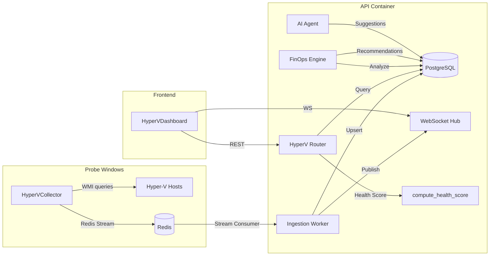
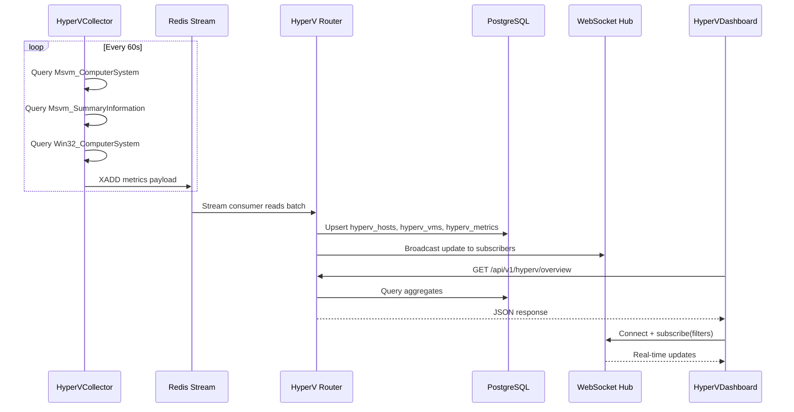

# Design Document: Hyper-V Observability Dashboard

## Overview

The Hyper-V Observability Dashboard extends the Coruja Monitor platform with dedicated monitoring for Microsoft Hyper-V virtualization infrastructure. It adds a WMI-based collector for Hyper-V hosts, REST + WebSocket APIs, a React dashboard with health scoring, resource gauges, heatmaps, FinOps analysis, and AI-driven optimization suggestions.

The module integrates into the existing architecture:
- **Probe** → new `HyperVCollector` using WMI classes (`Msvm_ComputerSystem`, `Msvm_SummaryInformation`, `Win32_ComputerSystem`) via the existing `WMIEngine` infrastructure
- **API** → new FastAPI router at `/api/v1/hyperv/` with REST endpoints and WebSocket at `/api/v1/ws/hyperv`
- **Frontend** → new `HyperVDashboard` React component integrated into the Sidebar under "Observabilidade"
- **Database** → four new PostgreSQL tables (`hyperv_hosts`, `hyperv_vms`, `hyperv_metrics`, `hyperv_finops_recommendations`)
- **Worker** → Celery tasks for periodic FinOps analysis and AI suggestion generation

### Key Design Decisions

1. **WMI over PowerShell**: The existing collector uses `subprocess` + PowerShell. The new design uses WMI queries via the existing `WMIEngine`/`wmi_pool` infrastructure for consistency and performance (< 10s per host).
2. **Dedicated tables over reusing `metrics`**: Hyper-V entities (hosts, VMs) have distinct schemas from generic sensors. Dedicated tables enable efficient queries and clear domain modeling.
3. **Redis Stream for ingestion**: Metrics flow through the existing `metrics:raw` Redis Stream pipeline, ensuring at-least-once delivery and decoupling probe from API.
4. **Health Score as a pure function**: The score computation is a stateless function of (cpu%, mem%, storage%, vm_ratio, alert_count), making it testable and deterministic.

## Architecture

### High-Level Data Flow



### Component Interaction Sequence



## Components and Interfaces

### 1. HyperVCollector (Probe)

**File**: `probe/collectors/hyperv_wmi_collector.py`

Replaces the existing basic `hyperv_collector.py` with a WMI-based implementation using the `WMIEngine` infrastructure.

```python
class HyperVWMICollector:
    """Collects Hyper-V metrics via WMI from configured hosts."""
    
    def __init__(self, hosts_config: List[Dict], wmi_pool: WMIConnectionPool):
        """
        Args:
            hosts_config: List of {"hostname": str, "ip": str} dicts
            wmi_pool: Existing WMI connection pool
        """
    
    def collect_host(self, host_config: Dict) -> Dict[str, Any]:
        """Collect all metrics for a single Hyper-V host.
        Returns structured payload with host-level and per-VM data.
        Timeout: 10s per host.
        """
    
    def collect_all(self) -> List[Dict[str, Any]]:
        """Collect from all configured hosts. Continues on failure."""
    
    def _query_vms(self, conn) -> List[Dict]:
        """Query Msvm_ComputerSystem for VM list and power states."""
    
    def _query_vm_summary(self, conn) -> List[Dict]:
        """Query Msvm_SummaryInformation for CPU, memory, uptime per VM."""
    
    def _query_host_info(self, conn) -> Dict:
        """Query Win32_ComputerSystem for host physical resources."""
```

**WMI Queries**:
- `SELECT * FROM Msvm_ComputerSystem WHERE Caption='Virtual Machine'` → VM list + states
- `SELECT * FROM Msvm_SummaryInformation` → CPU%, memory, uptime per VM
- `SELECT TotalPhysicalMemory, NumberOfLogicalProcessors FROM Win32_ComputerSystem` → host resources

**Metric Payload Schema**:
```json
{
  "type": "hyperv",
  "hostname": "SRVHVSPRD010",
  "ip": "192.168.31.110",
  "timestamp": "2026-03-20T10:00:00Z",
  "host": {
    "total_cpus": 32,
    "total_memory_gb": 256,
    "total_storage_gb": 2048,
    "cpu_percent": 45.2,
    "memory_percent": 72.1,
    "storage_percent": 58.3,
    "vm_count": 18,
    "running_vm_count": 15
  },
  "vms": [
    {
      "name": "VM-SQL-01",
      "state": "Running",
      "vcpus": 4,
      "memory_mb": 8192,
      "cpu_percent": 32.5,
      "disk_bytes": 107374182400,
      "uptime_seconds": 864000
    }
  ]
}
```

### 2. HyperV API Router

**File**: `api/routers/hyperv.py`

```python
router = APIRouter(prefix="/api/v1/hyperv", tags=["Hyper-V"])

# REST Endpoints
GET  /overview                    → Overview summary (hosts, VMs, alerts, health)
GET  /hosts                       → Host list with metrics and health scores
GET  /hosts/{host_id}/vms         → VMs for a specific host
GET  /vms                         → All VMs across all hosts
GET  /finops/recommendations      → FinOps analysis results
GET  /heatmap                     → Heatmap time-series grid
GET  /ai/suggestions              → AI optimization suggestions

# Query Parameters (shared)
?period=24h|7d|30d               → Time range filter
?host=<hostname>                 → Host filter
?status=running|stopped|paused|saved → VM state filter
```

### 3. HyperV WebSocket

**File**: `api/routers/hyperv_ws.py`

```python
router = APIRouter(tags=["Hyper-V WebSocket"])

@router.websocket("/api/v1/ws/hyperv")
async def ws_hyperv(websocket: WebSocket):
    """
    Real-time Hyper-V updates.
    
    Client → Server messages:
      {"action": "subscribe", "filters": {"host_id": "uuid", "status": "running"}}
    
    Server → Client messages:
      {"type": "overview_update", "timestamp": "...", "data": {...}}
      {"type": "host_update", "timestamp": "...", "data": {...}}
      {"type": "vm_update", "timestamp": "...", "data": {...}}
      {"type": "alert_update", "timestamp": "...", "data": {...}}
    """
```

**Connection Manager**: Extends the existing `ConnectionManager` pattern from `observability.py` with per-client subscription filters.

### 4. Health Score Engine

**File**: `api/services/hyperv_health.py`

```python
def compute_health_score(
    cpu_percent: float,       # 0-100
    memory_percent: float,    # 0-100
    storage_percent: float,   # 0-100
    vm_ratio: float,          # 0.0-1.0 (running/total)
    alert_count: int          # >= 0
) -> float:
    """
    Compute health score (0-100) using weighted factors:
      CPU:        0.30 weight (critical penalty if > 90%)
      Memory:     0.25 weight (critical penalty if > 95%)
      Storage:    0.20 weight
      VM ratio:   0.15 weight
      Alerts:     0.10 weight (penalty per alert)
    
    Returns: float between 0 and 100
    """
```

**Formula**:
```
cpu_score    = max(10, 30 * (1 - cpu/100))     if cpu > 90 else 30 * (1 - cpu/100)
mem_score    = max(5, 25 * (1 - mem/100))      if mem > 95 else 25 * (1 - mem/100)
storage_score = 20 * (1 - storage/100)
vm_score     = 15 * vm_ratio
alert_score  = max(0, 10 - alert_count * 2)

health_score = cpu_score + mem_score + storage_score + vm_score + alert_score
```

### 5. FinOps Engine

**File**: `api/services/hyperv_finops.py`

```python
class HyperVFinOpsEngine:
    """Analyzes Hyper-V metrics for cost optimization."""
    
    def detect_overprovisioned(self, vm_metrics: List) -> List[Dict]:
        """VMs with avg CPU < 20% for 7 consecutive days."""
    
    def detect_idle(self, vm_metrics: List) -> List[Dict]:
        """VMs with avg CPU < 5% for 30 consecutive minutes."""
    
    def estimate_vm_cost(self, vm: Dict, rates: Dict) -> float:
        """Monthly cost = vcpus * rate_vcpu + mem_gb * rate_mem + storage_gb * rate_storage."""
    
    def compute_density(self, host: Dict) -> Dict:
        """VMs/host, vCPU overcommit ratio, memory overcommit ratio."""
    
    def generate_recommendations(self) -> List[Dict]:
        """Categories: overprovisioned, idle, right-size, rebalance."""
```

### 6. HyperVDashboard (Frontend)

**File**: `frontend/src/components/HyperVDashboard.js` + `HyperVDashboard.css`

```
┌─────────────────────────────────────────────────────────────────┐
│  Header Cards                                                    │
│  ┌──────┐ ┌──────┐ ┌──────────┐ ┌──────────┐ ┌────────────┐   │
│  │Total │ │Total │ │VMs       │ │Alertas   │ │Health      │   │
│  │Hosts │ │VMs   │ │Rodando   │ │Ativos    │ │Score       │   │
│  └──────┘ └──────┘ └──────────┘ └──────────┘ └────────────┘   │
├─────────────────────────────────────────────────────────────────┤
│  Gauge Charts                    │  Filters                      │
│  ┌─────┐ ┌─────┐ ┌─────┐       │  [24h|7d|30d] [Host▼] [Status▼]│
│  │ CPU │ │ MEM │ │STOR │       │                                │
│  └─────┘ └─────┘ └─────┘       │                                │
├─────────────────────────────────────────────────────────────────┤
│  Host Table                                                      │
│  Nome | Status | CPU% | Mem% | Storage% | WMI ms | VMs | Score  │
│  ─────┼────────┼──────┼──────┼──────────┼────────┼─────┼──────  │
│  SRVHVSPRD010 | ● | 45% | 72% | 58% | 120ms | 18 | 85       │
│  SRVHVSPRD011 | ● | 38% | 65% | 42% | 95ms  | 12 | 91       │
├─────────────────────────────────────────────────────────────────┤
│  Top Consumers              │  Heatmap                           │
│  CPU:  1. VM-SQL-01 (78%)   │  ┌─────────────────────────┐      │
│        2. VM-APP-03 (65%)   │  │ ██░░██████░░░░████░░░░  │      │
│  MEM:  1. VM-SQL-01 (92%)   │  │ ░░░░██░░░░░░░░██░░░░░░  │      │
│        2. VM-DB-02  (85%)   │  └─────────────────────────┘      │
├─────────────────────────────────────────────────────────────────┤
│  FinOps Recommendations     │  AI Suggestions                    │
│  ⚠ VM-TEST-01: idle 3d     │  🤖 Move VM-SQL-01 → SRVHVSPRD011│
│  ⚠ VM-DEV-02: overprov.    │     Confiança: 0.85 [Recomendado] │
└─────────────────────────────────────────────────────────────────┘
```

**Component Structure**:
- `HyperVDashboard` (main container, state management, WebSocket connection)
  - `HyperVHeaderCards` (5 summary cards)
  - `HyperVGauges` (3 gauge charts: CPU, Memory, Storage)
  - `HyperVFilters` (period, host, status dropdowns)
  - `HyperVHostTable` (sortable table with expandable VM rows)
  - `HyperVTopConsumers` (top 5 CPU + top 5 Memory)
  - `HyperVHeatmap` (color-coded utilization grid)
  - `HyperVFinOps` (recommendations list)
  - `HyperVAISuggestions` (AI suggestions with confidence badges)

All labels in pt-BR. Uses existing `design-system.css` and `global-dark-override.css`.


## Data Models

### Database Schema

#### Table: `hyperv_hosts`

| Column | Type | Constraints | Description |
|--------|------|-------------|-------------|
| id | UUID | PK, default uuid_generate_v4() | Unique host identifier |
| hostname | VARCHAR(255) | NOT NULL | Host name (e.g., SRVHVSPRD010) |
| ip_address | VARCHAR(50) | NOT NULL | Host IP address |
| total_cpus | INTEGER | NOT NULL | Physical CPU count |
| total_memory_gb | FLOAT | NOT NULL | Total physical memory in GB |
| total_storage_gb | FLOAT | NOT NULL | Total storage in GB |
| cpu_percent | FLOAT | | Current CPU utilization |
| memory_percent | FLOAT | | Current memory utilization |
| storage_percent | FLOAT | | Current storage utilization |
| vm_count | INTEGER | DEFAULT 0 | Total VM count |
| running_vm_count | INTEGER | DEFAULT 0 | Running VM count |
| status | VARCHAR(20) | DEFAULT 'unknown' | online, unreachable, unknown |
| health_score | FLOAT | DEFAULT 0 | Computed health score (0-100) |
| wmi_latency_ms | FLOAT | | Last WMI query latency |
| last_seen | TIMESTAMP WITH TZ | | Last successful collection |
| created_at | TIMESTAMP WITH TZ | DEFAULT now() | Record creation time |

#### Table: `hyperv_vms`

| Column | Type | Constraints | Description |
|--------|------|-------------|-------------|
| id | UUID | PK, default uuid_generate_v4() | Unique VM identifier |
| host_id | UUID | FK → hyperv_hosts.id, NOT NULL | Parent host |
| name | VARCHAR(255) | NOT NULL | VM display name |
| state | VARCHAR(20) | NOT NULL | Running, Off, Saved, Paused |
| vcpus | INTEGER | | Allocated vCPUs |
| memory_mb | INTEGER | | Allocated memory in MB |
| disk_bytes | BIGINT | | Allocated disk in bytes |
| cpu_percent | FLOAT | | Current CPU usage |
| memory_percent | FLOAT | | Current memory usage |
| uptime_seconds | BIGINT | | VM uptime |
| last_updated | TIMESTAMP WITH TZ | DEFAULT now() | Last metric update |

#### Table: `hyperv_metrics`

| Column | Type | Constraints | Description |
|--------|------|-------------|-------------|
| id | BIGSERIAL | PK | Auto-increment ID |
| host_id | UUID | FK → hyperv_hosts.id, NOT NULL | Host reference |
| vm_id | UUID | FK → hyperv_vms.id, NULLABLE | VM reference (NULL = host-level) |
| metric_type | VARCHAR(50) | NOT NULL | cpu, memory, storage, vm_count |
| value | FLOAT | NOT NULL | Metric value |
| timestamp | TIMESTAMP WITH TZ | NOT NULL | Measurement time |

**Indexes**:
- `idx_hyperv_metrics_host_ts` ON (host_id, timestamp)
- `idx_hyperv_metrics_vm_ts` ON (vm_id, timestamp)

#### Table: `hyperv_finops_recommendations`

| Column | Type | Constraints | Description |
|--------|------|-------------|-------------|
| id | UUID | PK, default uuid_generate_v4() | Recommendation ID |
| vm_id | UUID | FK → hyperv_vms.id | Target VM |
| host_id | UUID | FK → hyperv_hosts.id | Target host |
| category | VARCHAR(50) | NOT NULL | overprovisioned, idle, right-size, rebalance |
| description | TEXT | NOT NULL | Human-readable description |
| suggested_action | TEXT | NOT NULL | Recommended action |
| estimated_savings | FLOAT | | Estimated monthly savings |
| confidence | FLOAT | | AI confidence score (0.0-1.0) |
| status | VARCHAR(20) | DEFAULT 'active' | active, dismissed |
| created_at | TIMESTAMP WITH TZ | DEFAULT now() | Creation time |

### SQLAlchemy Models

**File**: `api/models.py` (append to existing)

```python
import uuid
from sqlalchemy.dialects.postgresql import UUID

class HyperVHost(Base):
    __tablename__ = "hyperv_hosts"
    
    id = Column(UUID(as_uuid=True), primary_key=True, default=uuid.uuid4)
    hostname = Column(String(255), nullable=False)
    ip_address = Column(String(50), nullable=False)
    total_cpus = Column(Integer, nullable=False)
    total_memory_gb = Column(Float, nullable=False)
    total_storage_gb = Column(Float, nullable=False)
    cpu_percent = Column(Float)
    memory_percent = Column(Float)
    storage_percent = Column(Float)
    vm_count = Column(Integer, default=0)
    running_vm_count = Column(Integer, default=0)
    status = Column(String(20), default="unknown")
    health_score = Column(Float, default=0)
    wmi_latency_ms = Column(Float)
    last_seen = Column(DateTime(timezone=True))
    created_at = Column(DateTime(timezone=True), server_default=func.now())
    
    vms = relationship("HyperVVM", back_populates="host")

class HyperVVM(Base):
    __tablename__ = "hyperv_vms"
    
    id = Column(UUID(as_uuid=True), primary_key=True, default=uuid.uuid4)
    host_id = Column(UUID(as_uuid=True), ForeignKey("hyperv_hosts.id"), nullable=False)
    name = Column(String(255), nullable=False)
    state = Column(String(20), nullable=False)
    vcpus = Column(Integer)
    memory_mb = Column(Integer)
    disk_bytes = Column(Float)  # BIGINT via Float for SQLAlchemy compat
    cpu_percent = Column(Float)
    memory_percent = Column(Float)
    uptime_seconds = Column(Float)
    last_updated = Column(DateTime(timezone=True), server_default=func.now())
    
    host = relationship("HyperVHost", back_populates="vms")

class HyperVMetric(Base):
    __tablename__ = "hyperv_metrics"
    __table_args__ = (
        Index('idx_hyperv_metrics_host_ts', 'host_id', 'timestamp'),
        Index('idx_hyperv_metrics_vm_ts', 'vm_id', 'timestamp'),
    )
    
    id = Column(Integer, primary_key=True, index=True)
    host_id = Column(UUID(as_uuid=True), ForeignKey("hyperv_hosts.id"), nullable=False)
    vm_id = Column(UUID(as_uuid=True), ForeignKey("hyperv_vms.id"), nullable=True)
    metric_type = Column(String(50), nullable=False)
    value = Column(Float, nullable=False)
    timestamp = Column(DateTime(timezone=True), nullable=False)

class HyperVFinOpsRecommendation(Base):
    __tablename__ = "hyperv_finops_recommendations"
    
    id = Column(UUID(as_uuid=True), primary_key=True, default=uuid.uuid4)
    vm_id = Column(UUID(as_uuid=True), ForeignKey("hyperv_vms.id"))
    host_id = Column(UUID(as_uuid=True), ForeignKey("hyperv_hosts.id"))
    category = Column(String(50), nullable=False)
    description = Column(Text, nullable=False)
    suggested_action = Column(Text, nullable=False)
    estimated_savings = Column(Float)
    confidence = Column(Float)
    status = Column(String(20), default="active")
    created_at = Column(DateTime(timezone=True), server_default=func.now())
```

### API Response Schemas (Pydantic)

**File**: `api/schemas/hyperv.py`

```python
from pydantic import BaseModel
from typing import List, Optional
from uuid import UUID
from datetime import datetime

class HyperVOverview(BaseModel):
    total_hosts: int
    total_vms: int
    running_vms: int
    active_alerts: int
    health_score: float
    timestamp: datetime

class HyperVHostResponse(BaseModel):
    id: UUID
    hostname: str
    ip_address: str
    status: str
    cpu_percent: Optional[float]
    memory_percent: Optional[float]
    storage_percent: Optional[float]
    wmi_latency_ms: Optional[float]
    vm_count: int
    health_score: float

class HyperVVMResponse(BaseModel):
    id: UUID
    host_id: UUID
    host_name: Optional[str]
    name: str
    state: str
    vcpus: Optional[int]
    memory_mb: Optional[int]
    disk_bytes: Optional[float]
    cpu_percent: Optional[float]
    memory_percent: Optional[float]
    uptime_seconds: Optional[float]

class FinOpsRecommendation(BaseModel):
    id: UUID
    vm_name: str
    host_name: str
    category: str
    description: str
    suggested_action: str
    estimated_savings: Optional[float]
    confidence: Optional[float]
    status: str

class AISuggestion(BaseModel):
    category: str
    description: str
    affected_vms: List[str]
    target_host: Optional[str]
    confidence: float

class HeatmapCell(BaseModel):
    host_id: UUID
    hostname: str
    timestamp: datetime
    cpu_percent: float
    memory_percent: float

class HeatmapResponse(BaseModel):
    hosts: List[str]
    timestamps: List[datetime]
    data: List[HeatmapCell]
```

### Sidebar Integration

Add to `CATS` array in `frontend/src/components/Sidebar.js`, inside the "observability" category:

```javascript
{ id: "hyperv", icon: "🖥️", label: "Hyper-V" }
```

### MainLayout Integration

Add to `frontend/src/components/MainLayout.js`:

```javascript
import HyperVDashboard from './HyperVDashboard';

// In the page rendering switch:
case 'hyperv': return <HyperVDashboard />;
```

### Probe Configuration

Add to `probe/config.yaml`:

```yaml
hyperv:
  enabled: true
  collection_interval: 60
  hosts:
    - hostname: SRVHVSPRD010
      ip: 192.168.31.110
    - hostname: SRVHVSPRD011
      ip: 192.168.31.111
```

### API Router Registration

Add to `api/main.py`:

```python
from routers import hyperv, hyperv_ws
app.include_router(hyperv.router)
app.include_router(hyperv_ws.router)
```


## Correctness Properties

*A property is a characteristic or behavior that should hold true across all valid executions of a system — essentially, a formal statement about what the system should do. Properties serve as the bridge between human-readable specifications and machine-verifiable correctness guarantees.*

### Property 1: Health Score Range Invariant

*For any* valid combination of CPU utilization (0–100), memory utilization (0–100), storage utilization (0–100), VM ratio (0.0–1.0), and alert count (≥ 0), `compute_health_score` SHALL return a value between 0 and 100 inclusive. Additionally, when CPU > 90%, the CPU component SHALL not exceed 10; when memory > 95%, the memory component SHALL not exceed 5.

**Validates: Requirements 6.1, 6.2, 6.3, 6.4, 11.2**

### Property 2: Collector Payload Completeness

*For any* set of raw WMI host data (CPU count, memory, storage) and VM data (name, state, vcpus, memory, disk), the `HyperVWMICollector.collect_host` output SHALL contain all required host-level fields (`total_cpus`, `total_memory_gb`, `total_storage_gb`, `cpu_percent`, `memory_percent`, `storage_percent`, `vm_count`, `running_vm_count`) and each VM entry SHALL contain all required fields (`name`, `state`, `vcpus`, `memory_mb`, `cpu_percent`, `disk_bytes`, `uptime_seconds`).

**Validates: Requirements 1.4**

### Property 3: Collector Error Resilience

*For any* list of N configured hosts where K hosts fail WMI queries (0 ≤ K ≤ N), `collect_all` SHALL return results for exactly N − K hosts, each failed host SHALL have status "unreachable", and the collector SHALL not raise an exception.

**Validates: Requirements 1.5**

### Property 4: API Filter Correctness

*For any* combination of filters (period ∈ {24h, 7d, 30d}, host name, VM status ∈ {running, stopped, paused, saved}) applied to any dataset, all items in the API response SHALL match every active filter criterion. Specifically: all timestamps within the period range, all items belonging to the specified host, and all VMs having the specified state.

**Validates: Requirements 2.6, 2.7, 2.8**

### Property 5: Host-VM Ownership

*For any* host_id, the response from `GET /hosts/{host_id}/vms` SHALL contain only VMs whose `host_id` matches the requested host_id, and the count SHALL equal the host's `vm_count` field.

**Validates: Requirements 2.3**

### Property 6: WebSocket Message Structure

*For any* message broadcast by the HyperV WebSocket, the JSON payload SHALL contain the fields `type` (one of "overview_update", "host_update", "vm_update", "alert_update"), `timestamp` (ISO 8601 string), and `data` (object).

**Validates: Requirements 3.3**

### Property 7: WebSocket Subscription Filtering

*For any* client subscription with filters `{host_id, status}` and any set of broadcast messages, the client SHALL receive only messages where the data matches all specified filter fields. Messages not matching any filter field SHALL not be delivered to that client.

**Validates: Requirements 3.4**

### Property 8: Top Consumers Sorting

*For any* set of VMs with CPU and memory values, the "Top 5 by CPU" list SHALL be sorted in descending order of `cpu_percent`, and the "Top 5 by Memory" list SHALL be sorted in descending order of `memory_mb`. Both lists SHALL contain at most 5 entries.

**Validates: Requirements 4.5**

### Property 9: FinOps Overprovisioned Detection

*For any* VM with a time series of CPU metrics spanning 7 consecutive days where every daily average is below 20%, the FinOps engine SHALL flag it as "overprovisioned". *For any* VM where at least one daily average is ≥ 20% within the 7-day window, it SHALL NOT be flagged as "overprovisioned".

**Validates: Requirements 7.1**

### Property 10: FinOps Idle Detection

*For any* VM with a time series of CPU metrics spanning 30 consecutive minutes where every sample is below 5%, the FinOps engine SHALL flag it as "idle". *For any* VM where at least one sample is ≥ 5% within the 30-minute window, it SHALL NOT be flagged as "idle".

**Validates: Requirements 7.2**

### Property 11: FinOps Cost Estimation

*For any* VM with allocated vCPUs (≥ 0), memory in GB (≥ 0), and storage in GB (≥ 0), and any set of positive unit rates (rate_vcpu, rate_mem, rate_storage), the estimated monthly cost SHALL equal `vcpus × rate_vcpu + memory_gb × rate_mem + storage_gb × rate_storage`, and the result SHALL be ≥ 0.

**Validates: Requirements 7.3**

### Property 12: FinOps Density Computation

*For any* host with `total_cpus > 0` and `total_memory_gb > 0` and a list of VMs, the vCPU overcommit ratio SHALL equal `sum(vm.vcpus) / host.total_cpus`, the memory overcommit ratio SHALL equal `sum(vm.memory_gb) / host.total_memory_gb`, and VMs per host SHALL equal `len(vms)`.

**Validates: Requirements 7.4**

### Property 13: Recommendation Completeness

*For any* FinOps recommendation generated by the engine, it SHALL have a `category` in {"overprovisioned", "idle", "right-size", "rebalance"}, and SHALL include non-empty `vm_name`, `host_name`, `suggested_action`, and `description` fields.

**Validates: Requirements 7.5, 7.6**

### Property 14: Hotspot Detection

*For any* host with a time series where CPU > 85% or memory > 90% for more than 5 consecutive minutes, the hotspot detector SHALL flag it. *For any* host where neither condition persists for 5 consecutive minutes, it SHALL NOT be flagged.

**Validates: Requirements 8.1**

### Property 15: Heatmap Color Mapping

*For any* utilization value in [0, 100], the heatmap color function SHALL return green for [0, 50), yellow for [50, 75), and red for [75, 100].

**Validates: Requirements 8.3**

### Property 16: AI Suggestion Completeness

*For any* AI-generated suggestion, it SHALL have a `category` in {"move VM to less loaded host", "shutdown idle VM", "balance cluster workload"}, a `confidence` score in [0.0, 1.0], a non-empty `description`, and a non-empty `affected_vms` list.

**Validates: Requirements 9.1, 9.2**

### Property 17: Recomendado Badge Threshold

*For any* AI suggestion, the "Recomendado" badge SHALL be displayed if and only if `confidence > 0.8`.

**Validates: Requirements 9.3**

## Error Handling

### Probe (HyperVCollector)

| Error Scenario | Handling | Recovery |
|---|---|---|
| WMI connection refused | Log error with host IP, mark host "unreachable" | Retry next cycle (60s) |
| WMI query timeout (>10s) | Cancel query, log timeout, mark host "unreachable" | Retry next cycle |
| Invalid WMI data (missing fields) | Log warning, skip VM/metric, continue | Next collection fills gaps |
| Redis stream unavailable | Buffer in memory (fallback queue, max 50k events) | Drain on reconnect |
| All hosts unreachable | Log critical, emit alert to Alert_Engine | Continue cycling |

### API (HyperV Router)

| Error Scenario | Handling | HTTP Response |
|---|---|---|
| Non-existent host_id | Return 404 | `{"error": "Host not found", "host_id": "..."}` |
| Invalid period parameter | Return 422 | Pydantic validation error |
| Database connection failure | Return 503 | `{"error": "Service temporarily unavailable"}` |
| FinOps no data for period | Return 200 with empty results | `{"recommendations": [], "total": 0}` |

### WebSocket

| Error Scenario | Handling |
|---|---|
| Client sends invalid JSON | Send error message, keep connection |
| Client disconnects | Remove from broadcast list, release resources |
| Broadcast failure to single client | Remove dead client, continue broadcasting to others |
| Idle connection > 60s | Send ping frame; close if no pong within 10s |

### Frontend

| Error Scenario | Handling |
|---|---|
| API request fails | Show toast notification in pt-BR, display cached data |
| WebSocket disconnects | Auto-reconnect with exponential backoff (1s, 2s, 4s, max 30s) |
| Empty data state | Show "Nenhum dado disponível" placeholder |

## Testing Strategy

### Unit Tests

**File**: `tests/test_hyperv_module.py`

- Health Score computation with known inputs and expected outputs
- FinOps overprovisioned detection with 7-day sample data
- FinOps idle detection with 30-minute sample data
- FinOps cost estimation with known rates
- API endpoint response structure (mocked DB)
- HTTP 404 for non-existent host_id
- Heatmap color mapping for boundary values (0, 49, 50, 74, 75, 100)
- WebSocket message structure validation
- Collector payload structure with mocked WMI data
- Hotspot detection with boundary time series

### Property-Based Tests

**Library**: `hypothesis` (already used in the project, see `tests/test_pbt_properties.py`)

**File**: `tests/test_hyperv_pbt.py`

**Configuration**: Minimum 100 iterations per property (using `settings(max_examples=100)`)

Each property test MUST be tagged with a comment referencing the design property:

```python
# Feature: hyperv-observability, Property 1: Health Score Range Invariant
@given(
    cpu=st.floats(min_value=0, max_value=100),
    memory=st.floats(min_value=0, max_value=100),
    storage=st.floats(min_value=0, max_value=100),
    vm_ratio=st.floats(min_value=0, max_value=1),
    alert_count=st.integers(min_value=0, max_value=100),
)
@settings(max_examples=100)
def test_health_score_range(cpu, memory, storage, vm_ratio, alert_count):
    score = compute_health_score(cpu, memory, storage, vm_ratio, alert_count)
    assert 0 <= score <= 100
```

Each correctness property (1–17) SHALL be implemented by a SINGLE property-based test function. Property tests validate universal invariants; unit tests validate specific examples and edge cases. Together they provide comprehensive coverage.

### Integration Tests

- WebSocket connection and message delivery (< 5s latency)
- End-to-end: collector → Redis → API → DB → WebSocket → client
- Sidebar navigation to HyperV dashboard
- Pre-configured hosts (SRVHVSPRD010, SRVHVSPRD011) present in config

### Test Organization

```
tests/
  test_hyperv_module.py      # Unit tests
  test_hyperv_pbt.py         # Property-based tests (Hypothesis)
  test_hyperv_integration.py # Integration tests (WebSocket, E2E)
```
