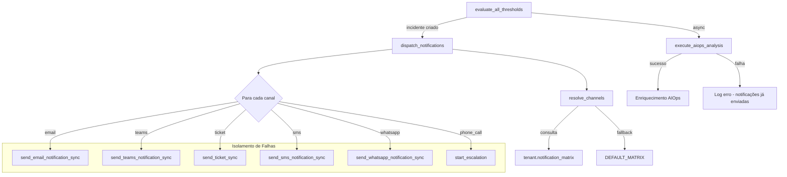

# Design — Matriz de Notificação Inteligente

## Visão Geral

A Matriz de Notificação Inteligente introduz um **Dispatcher** que opera imediatamente na criação de incidentes (dentro de `evaluate_all_thresholds`), desacoplado do pipeline AIOps. O Dispatcher consulta uma estrutura declarativa (`notification_matrix`) que mapeia cada `sensor_type` a um conjunto de canais de notificação, e despacha para cada canal de forma isolada e resiliente.

O design se baseia em três princípios:

1. **Independência do AIOps** — notificações são enviadas no momento da criação do incidente; o AIOps pode enriquecer depois, mas nunca bloqueia.
2. **Resolução determinística** — a função `resolve_channels(sensor_type) → set[str]` é pura e testável com property-based tests.
3. **Resiliência por canal** — cada envio é isolado com try/except individual; falha em um canal não impede os demais.

### Decisões Arquiteturais

| Decisão | Justificativa |
|---|---|
| Dispatcher chamado em `evaluate_all_thresholds` | Garante envio imediato sem depender do AIOps |
| Matriz armazenada em `tenant.notification_matrix` (JSON) | Permite customização por tenant sem migração de schema |
| Fallback para matriz hardcoded | Garante funcionamento mesmo sem configuração |
| Funções sync de SMS/WhatsApp no worker | Worker Celery é síncrono; funções async existem apenas no router |
| Phone call via `start_escalation()` existente | Reutiliza infraestrutura de escalação já implementada |

## Arquitetura



### Fluxo de Dados

1. `evaluate_all_thresholds` cria o `Incident` no banco.
2. Chama `dispatch_notifications(incident_id)` como Celery task (`.delay()`).
3. `dispatch_notifications` carrega sensor, server, tenant.
4. Chama `resolve_channels(sensor_type, tenant.notification_matrix)` — função pura.
5. Para cada canal retornado, executa a função de envio correspondente em try/except isolado.
6. Retorna resumo `{sent: [...], failed: [...]}`.
7. Em paralelo, `execute_aiops_analysis.delay(incident_id)` roda independentemente.

## Componentes e Interfaces

### 1. `resolve_channels(sensor_type: str, custom_matrix: dict | None) → set[str]`

Função pura no módulo `worker/notification_dispatcher.py`.

```python
VALID_CHANNELS = {"email", "teams", "ticket", "sms", "whatsapp", "phone_call"}

VALID_SENSOR_TYPES = {
    "ping", "disk", "service", "http", "printer",
    "conflex", "engetron", "snmp", "system",
    "network_in", "network_out"
}

DEFAULT_MATRIX: dict[str, list[str]] = {
    "ping":      ["email", "ticket", "teams"],
    "disk":      ["email", "teams", "ticket"],
    "service":   ["email", "teams"],
    "http":      ["email", "teams", "ticket", "sms", "whatsapp"],
    "printer":   ["email", "teams", "ticket"],
    "conflex":   ["phone_call", "email", "ticket", "teams", "sms", "whatsapp"],
    "engetron":  ["phone_call", "email", "ticket", "teams", "sms", "whatsapp"],
    "snmp":      ["email", "teams", "sms"],
    "system":    ["email"],  # Reboot — apenas email informativo
}
```

**Regras:**
- Se `custom_matrix` contém o `sensor_type`, usa os canais do custom_matrix.
- Se não, usa `DEFAULT_MATRIX`.
- Se `sensor_type` não existe em nenhum dos dois, retorna `{"email"}` (fallback seguro).
- Filtra canais inválidos (interseção com `VALID_CHANNELS`).
- Sempre retorna conjunto não-vazio (email como mínimo).

### 2. `dispatch_notifications(incident_id: int)` — Celery Task

Orquestra o envio para todos os canais resolvidos.

```python
@app.task
def dispatch_notifications(incident_id: int) -> dict:
    """Despacha notificações para todos os canais da matriz."""
    # 1. Carregar incident, sensor, server, tenant
    # 2. Forçar priority=5 para sensor_type='ping'
    # 3. Ignorar network_in/network_out (metric_only)
    # 4. resolve_channels(sensor.sensor_type, tenant.notification_matrix)
    # 5. Para cada canal: try/except isolado
    # 6. phone_call → start_escalation() com dados do tenant
    # 7. Retornar {sent: [...], failed: [...]}
```

### 3. `send_sms_notification_sync(config: dict, incident_data: dict) → dict`

Nova função síncrona no `worker/tasks.py`, baseada na versão async `send_twilio_notification` do router.

```python
def send_sms_notification_sync(config: dict, incident_data: dict) -> dict:
    """Envia SMS via Twilio (síncrono para Celery worker)."""
    from twilio.rest import Client
    # Usa config['twilio'] do tenant.notification_config
    # Retorna {'success': bool, 'error'?: str}
```

### 4. `send_whatsapp_notification_sync(config: dict, incident_data: dict) → dict`

Nova função síncrona no `worker/tasks.py`, baseada na versão async `send_twilio_whatsapp` do router.

```python
def send_whatsapp_notification_sync(config: dict, incident_data: dict) -> dict:
    """Envia WhatsApp via Twilio (síncrono para Celery worker)."""
    from twilio.rest import Client
    # Usa config['whatsapp'] do tenant.notification_config
    # Retorna {'success': bool, 'error'?: str}
```

### 5. `send_ticket_sync(notification_config: dict, incident_data: dict) → dict`

Função wrapper que detecta qual sistema de tickets está habilitado (TOPdesk, Conecta, GLPI, Dynamics 365) e chama a função sync correspondente.

```python
def send_ticket_sync(notification_config: dict, incident_data: dict) -> dict:
    """Envia chamado para o sistema de tickets configurado."""
    if notification_config.get('topdesk', {}).get('enabled'):
        return send_topdesk_notification_sync(...)
    elif notification_config.get('kiro_conecta', {}).get('enabled'):
        return send_kiro_conecta_notification_sync(...)
    elif notification_config.get('dynamics365', {}).get('enabled'):
        return send_dynamics365_notification_sync(...)
    # fallback: nenhum sistema de tickets configurado
    return {'success': False, 'error': 'Nenhum sistema de tickets habilitado'}
```

### 6. API Endpoints — `/notifications/matrix`

Adicionados ao router `api/routers/notifications.py`:

```python
# GET /api/v1/notifications/matrix
async def get_notification_matrix(db, current_user) -> dict:
    """Retorna a matriz de notificação do tenant (ou default)."""

# PUT /api/v1/notifications/matrix
async def update_notification_matrix(db, current_user, matrix: dict) -> dict:
    """Salva a matriz de notificação no tenant.notification_matrix."""
```

### 7. Frontend — Seção Matriz de Notificação

Novo componente `NotificationMatrix.js` renderizado dentro de `Settings.js` na aba de Notificações.

- Tabela com linhas = sensor_types, colunas = canais
- Checkboxes editáveis
- Botão "Salvar" chama PUT `/notifications/matrix`
- Botão "Adicionar Categoria" para sensor_types customizados
- Carrega dados via GET `/notifications/matrix` no mount

## Modelos de Dados

### Tenant — Novo Campo `notification_matrix`

```python
# models.py — adicionar ao modelo Tenant
notification_matrix = Column(JSON)  # Matriz de notificação por sensor_type
```

**Estrutura JSON:**

```json
{
  "ping": ["email", "ticket", "teams"],
  "disk": ["email", "teams", "ticket"],
  "service": ["email", "teams"],
  "http": ["email", "teams", "ticket", "sms", "whatsapp"],
  "printer": ["email", "teams", "ticket"],
  "conflex": ["phone_call", "email", "ticket", "teams", "sms", "whatsapp"],
  "engetron": ["phone_call", "email", "ticket", "teams", "sms", "whatsapp"],
  "snmp": ["email", "teams", "sms"],
  "system": ["email"]
}
```

### Pydantic Models — API

```python
class NotificationMatrixUpdate(BaseModel):
    matrix: Dict[str, List[str]]  # sensor_type → lista de canais

class NotificationMatrixResponse(BaseModel):
    matrix: Dict[str, List[str]]
    is_default: bool  # True se usando DEFAULT_MATRIX (tenant sem customização)
```

### Resultado do Dispatch

```python
@dataclass
class DispatchResult:
    incident_id: int
    sensor_type: str
    channels_resolved: list[str]
    channels_sent: list[str]
    channels_failed: list[dict]  # [{channel: str, error: str}]
```

### Migração de Banco

```sql
ALTER TABLE tenants ADD COLUMN notification_matrix JSON;
```


## Propriedades de Corretude

*Uma propriedade é uma característica ou comportamento que deve ser verdadeiro em todas as execuções válidas de um sistema — essencialmente, uma declaração formal sobre o que o sistema deve fazer. Propriedades servem como ponte entre especificações legíveis por humanos e garantias de corretude verificáveis por máquina.*

### Propriedade 1: Determinismo da resolução de canais

*Para qualquer* `sensor_type` e qualquer `custom_matrix` (incluindo None), chamar `resolve_channels(sensor_type, custom_matrix)` duas vezes com os mesmos argumentos deve retornar exatamente o mesmo conjunto de canais.

**Valida: Requisitos 10.1, 10.2**

### Propriedade 2: Email sempre presente

*Para qualquer* `sensor_type` válido (exceto `network_in` e `network_out` que são metric_only) e qualquer `custom_matrix` válida, o conjunto retornado por `resolve_channels` deve sempre conter `"email"`.

**Valida: Requisitos 8.1**

### Propriedade 3: Resultado não-vazio

*Para qualquer* `sensor_type` (incluindo tipos desconhecidos/não mapeados) e qualquer `custom_matrix`, `resolve_channels` deve retornar um conjunto com pelo menos um canal.

**Valida: Requisitos 10.3**

### Propriedade 4: Fallback seguro para tipos desconhecidos

*Para qualquer* string `sensor_type` que não esteja mapeada nem na `custom_matrix` nem na `DEFAULT_MATRIX`, `resolve_channels` deve retornar um conjunto contendo pelo menos `"email"`.

**Valida: Requisitos 10.4**

### Propriedade 5: Custom matrix sobrescreve default com fallback

*Para qualquer* `sensor_type` e qualquer `custom_matrix` não-nula que contenha esse `sensor_type`, `resolve_channels` deve retornar os canais definidos na `custom_matrix` (não os da `DEFAULT_MATRIX`). Se a `custom_matrix` for None ou não contiver o `sensor_type`, deve retornar os canais da `DEFAULT_MATRIX`.

**Valida: Requisitos 11.6, 11.7**

### Propriedade 6: Somente canais válidos

*Para qualquer* `sensor_type` e qualquer `custom_matrix` (incluindo matrizes com canais inválidos), `resolve_channels` deve retornar apenas canais pertencentes ao conjunto `VALID_CHANNELS = {"email", "teams", "ticket", "sms", "whatsapp", "phone_call"}`.

**Valida: Requisitos 10.1, 10.5**

### Propriedade 7: Isolamento de falhas entre canais

*Para qualquer* conjunto de canais resolvidos e qualquer subconjunto desses canais que falhe durante o envio, os canais restantes devem completar o envio com sucesso (a falha de um canal não impede os demais).

**Valida: Requisitos 9.1, 9.2, 7.3**

### Propriedade 8: Completude do resultado de dispatch

*Para qualquer* execução de `dispatch_notifications`, a união dos canais em `channels_sent` e os canais em `channels_failed` deve ser igual ao conjunto `channels_resolved` (nenhum canal é perdido ou duplicado).

**Valida: Requisitos 9.3**

### Propriedade 9: Prioridade forçada para PING

*Para qualquer* sensor com `sensor_type='ping'` e qualquer valor de `priority` configurado no banco, o Dispatcher deve usar `priority=5` ao processar o sensor.

**Valida: Requisitos 5.1, 5.2**

### Propriedade 10: Round-trip da API de matriz

*Para qualquer* matriz de notificação válida (dicionário de `sensor_type → lista de canais válidos`), salvar via PUT `/notifications/matrix` e depois ler via GET `/notifications/matrix` deve retornar a mesma matriz.

**Valida: Requisitos 11.4, 11.5**

## Tratamento de Erros

| Cenário | Comportamento |
|---|---|
| Canal individual falha | Log do erro com detalhes (canal, erro, incident_id); continua com próximo canal |
| Todos os canais falham | Log de alerta crítico; retorna resultado com todos em `channels_failed` |
| Tenant sem `notification_matrix` | Usa `DEFAULT_MATRIX` como fallback |
| Tenant sem `notification_config` | Log warning; nenhum envio possível (sem credenciais) |
| `sensor_type` desconhecido | Fallback para `{"email"}` |
| Canal na matriz mas não configurado no tenant | Trata como falha do canal (ex: SMS na matriz mas Twilio não configurado) |
| SMS/WhatsApp Twilio falha | Log erro; continua com demais canais |
| `start_escalation` falha | Log erro; demais canais (email, teams, etc.) já foram enviados |
| Redis indisponível (cooldown) | Fail-open: prossegue sem cooldown |
| Canais inválidos na custom_matrix | Filtrados silenciosamente; se restar vazio, aplica fallback `{"email"}` |

## Estratégia de Testes

### Abordagem Dual: Testes Unitários + Property-Based Tests

A estratégia combina testes unitários para exemplos específicos e edge cases com property-based tests (Hypothesis) para validação universal.

### Biblioteca de Property-Based Testing

- **Hypothesis** (já em uso no projeto — diretório `.hypothesis/` presente)
- Mínimo de 100 iterações por property test (`@settings(max_examples=100)`)

### Testes Unitários

Focam em exemplos concretos e edge cases:

1. **Mapeamento default por sensor_type** — verificar que cada sensor_type retorna os canais esperados conforme Requisitos 2.1-2.7, 3.1
2. **network_in/network_out são metric_only** — verificar que não geram dispatch (Requisito 4.1)
3. **conflex/engetron incluem phone_call** — verificar que `start_escalation` é chamado (Requisito 6.1)
4. **Reboot (system) envia apenas email** — verificar mapeamento (Requisito 3.1)
5. **API endpoints GET/PUT** — testes de integração com banco de dados

### Property-Based Tests (Hypothesis)

Cada propriedade do design deve ser implementada como um único test com Hypothesis:

1. **test_resolve_channels_deterministic** — Feature: notification-matrix, Property 1: Determinismo da resolução de canais
2. **test_resolve_channels_email_always_present** — Feature: notification-matrix, Property 2: Email sempre presente
3. **test_resolve_channels_non_empty** — Feature: notification-matrix, Property 3: Resultado não-vazio
4. **test_resolve_channels_fallback_unknown** — Feature: notification-matrix, Property 4: Fallback seguro para tipos desconhecidos
5. **test_resolve_channels_custom_override** — Feature: notification-matrix, Property 5: Custom matrix sobrescreve default com fallback
6. **test_resolve_channels_valid_only** — Feature: notification-matrix, Property 6: Somente canais válidos
7. **test_dispatch_fault_isolation** — Feature: notification-matrix, Property 7: Isolamento de falhas entre canais
8. **test_dispatch_result_completeness** — Feature: notification-matrix, Property 8: Completude do resultado de dispatch
9. **test_ping_priority_forced** — Feature: notification-matrix, Property 9: Prioridade forçada para PING
10. **test_api_matrix_round_trip** — Feature: notification-matrix, Property 10: Round-trip da API de matriz

### Estratégias de Geração (Hypothesis)

```python
# Gerador de sensor_type válido
sensor_types = st.sampled_from([
    "ping", "disk", "service", "http", "printer",
    "conflex", "engetron", "snmp", "system"
])

# Gerador de sensor_type arbitrário (incluindo desconhecidos)
any_sensor_type = st.text(min_size=1, max_size=50)

# Gerador de canal válido
valid_channels = st.sampled_from(["email", "teams", "ticket", "sms", "whatsapp", "phone_call"])

# Gerador de canal arbitrário (incluindo inválidos)
any_channel = st.text(min_size=1, max_size=30)

# Gerador de custom_matrix
custom_matrix = st.one_of(
    st.none(),
    st.dictionaries(
        keys=st.text(min_size=1, max_size=30),
        values=st.lists(any_channel, min_size=0, max_size=6),
        min_size=0, max_size=15
    )
)
```
