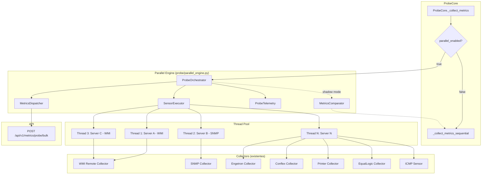
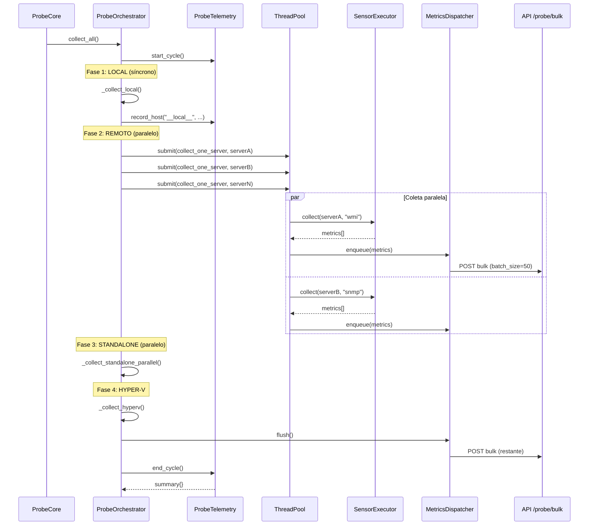
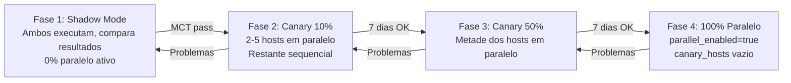

# Documento de Design — Coleta Paralela de Probes

## Visão Geral

Este documento descreve o design técnico para a refatoração do sistema de coleta de métricas do Coruja Monitor, migrando do modo sequencial atual para um modo paralelo baseado em `ThreadPoolExecutor`. A arquitetura é composta por 4 componentes principais (ProbeOrchestrator, SensorExecutor, MetricsDispatcher, ProbeTelemetry) e um módulo de validação MCT (MetricsComparator) para garantir equivalência de resultados durante a migração.

O sistema atual no `ProbeCore._collect_metrics_sequential()` executa a coleta em série: LOCAL → REMOTO → STANDALONE → HYPER-V. Com ~50 servidores remotos e timeouts de SNMP/WMI, o ciclo leva ~3 minutos. O modo paralelo visa reduzir para <30 segundos, mantendo compatibilidade total com a API existente (`/api/v1/metrics/probe/bulk`) e permitindo rollback instantâneo via feature flag.

### Decisões de Design

1. **Feature flag no `config.yaml`**: Permite ativar/desativar sem deploy. O `ProbeCore.__init__` já implementa essa lógica.
2. **ThreadPoolExecutor sobre ProcessPoolExecutor**: Coleta é I/O-bound (rede WMI/SNMP/HTTP), não CPU-bound. Threads são mais leves e compartilham memória.
3. **Fases sequenciais com paralelismo interno**: LOCAL (síncrono) → REMOTO (paralelo) → STANDALONE (paralelo) → HYPER-V. Mantém a ordem lógica mas paraleliza dentro de cada fase.
4. **Despacho incremental opcional**: Permite que o NOC veja métricas antes do ciclo completo, sem quebrar o modo bulk existente.
5. **Shadow mode para validação MCT**: Executa ambos os modos simultaneamente e compara resultados antes de migrar.
6. **Canary release**: Ativa paralelo em subconjunto de hosts antes de ativar para todos.

## Arquitetura



### Fluxo de Execução — Modo Paralelo



## Componentes e Interfaces

### 1. ProbeOrchestrator

Orquestrador principal que substitui o loop sequencial. Recebe referência ao `ProbeCore` e configuração do `config.yaml`.

```python
class ProbeOrchestrator:
    def __init__(self, probe_core: ProbeCore, config: Dict[str, Any]):
        """
        Args:
            probe_core: Instância do ProbeCore (acesso a collectors, buffer, config)
            config: Dict com max_workers, timeout_seconds, dispatch_mode, canary_hosts
        """
    
    def collect_all(self) -> Dict[str, Any]:
        """Executa ciclo completo de coleta paralela. Retorna summary da telemetria."""
    
    def _collect_local(self, timestamp: datetime) -> None:
        """Coleta síncrona de sensores locais (CPU, RAM, Disco, Rede)."""
    
    def _fetch_servers(self) -> List[Dict]:
        """Busca lista de servidores da API. Filtra servidor local."""
    
    def _collect_servers_parallel(self, servers: List[Dict], timestamp: datetime) -> None:
        """Submete coleta de cada servidor remoto ao ThreadPoolExecutor."""
    
    def _collect_standalone_parallel(self, timestamp: datetime) -> None:
        """Coleta sensores standalone via lógica existente."""
    
    def _collect_hyperv(self) -> None:
        """Coleta Hyper-V via método existente do ProbeCore."""
```

**Responsabilidades:**
- Gerenciar o ciclo de vida do `ThreadPoolExecutor`
- Coordenar as 4 fases de coleta (LOCAL, REMOTO, STANDALONE, HYPER-V)
- Aplicar filtro de canary hosts quando configurado
- Tratar timeouts e exceções por servidor sem afetar os demais
- Delegar telemetria ao `ProbeTelemetry` e despacho ao `MetricsDispatcher`

### 2. SensorExecutor

Componente responsável pela execução isolada de coleta por tipo de sensor. Encapsula a lógica de roteamento existente no `ProbeCore`.

```python
class SensorExecutor:
    def __init__(self, probe_core: ProbeCore):
        """Recebe referência ao ProbeCore para acessar métodos de coleta existentes."""
    
    def collect_server(self, server: Dict) -> List[Dict]:
        """
        Coleta métricas de um servidor remoto.
        Roteia para WMI ou SNMP baseado em monitoring_protocol.
        Retorna lista de métricas coletadas.
        """
    
    def collect_standalone(self, sensor: Dict, timestamp: datetime) -> List[Dict]:
        """
        Coleta métrica de um sensor standalone.
        Roteia para: HTTP → ICMP → Engetron → Conflex → Printer → EqualLogic → SNMP → fallback.
        """
```

**Responsabilidades:**
- Isolar execução de cada tipo de sensor
- Garantir que falha em um coletor não propague para outros
- Preservar a lógica de roteamento de sensores standalone existente
- Retornar métricas no formato padrão do buffer

### 3. MetricsDispatcher

Gerencia o envio de métricas à API com suporte a despacho incremental e bulk.

```python
class MetricsDispatcher:
    def __init__(self, api_url: str, probe_token: str, batch_size: int = 50):
        """
        Args:
            api_url: URL base da API (ex: http://192.168.31.161:8000)
            probe_token: Token de autenticação da sonda
            batch_size: Tamanho do micro-batch para envio incremental
        """
    
    def enqueue(self, metrics: List[Dict]) -> None:
        """Adiciona métricas ao buffer. Envia se atingir batch_size (thread-safe)."""
    
    def flush(self) -> None:
        """Força envio de todas as métricas restantes no buffer."""
    
    def _flush(self) -> None:
        """Envio interno: formata e envia via POST ao /api/v1/metrics/probe/bulk."""
    
    @property
    def stats(self) -> Dict[str, int]:
        """Retorna contadores: sent, errors, buffered."""
```

**Responsabilidades:**
- Buffer thread-safe com `threading.Lock`
- Formatação de métricas no formato JSON esperado pela API
- Envio via `httpx.Client` com timeout de 15s
- Contadores de métricas enviadas e erros
- Flush automático ao atingir `batch_size` e flush forçado ao final do ciclo

### 4. ProbeTelemetry

Componente de observabilidade que registra métricas de performance do ciclo de coleta.

```python
class ProbeTelemetry:
    def __init__(self):
        """Inicializa com Lock para acesso thread-safe."""
    
    def start_cycle(self) -> None:
        """Marca início do ciclo. Limpa dados do ciclo anterior."""
    
    def end_cycle(self) -> None:
        """Marca fim do ciclo."""
    
    def record_host(self, host: str, duration_ms: float, metrics_count: int, error: str = None) -> None:
        """Registra resultado da coleta de um host (thread-safe)."""
    
    @property
    def cycle_duration_ms(self) -> float:
        """Duração do ciclo em milissegundos."""
    
    def summary(self) -> Dict[str, Any]:
        """Retorna sumário estruturado do ciclo."""
```

**Sumário retornado:**
```json
{
    "cycle_duration_ms": 12500,
    "total_hosts": 45,
    "total_metrics": 1230,
    "total_errors": 2,
    "slowest_host": "srv-db-01",
    "slowest_ms": 8500,
    "errors": {"srv-legacy": "WMI timeout"}
}
```

### 5. MetricsComparator (MCT Shadow Mode)

Módulo de validação que compara resultados entre modo sequencial e paralelo.

```python
class MetricsComparator:
    TOLERANCE_PCT: float = 5.0  # Diferença aceitável em %
    
    def compare(self, host: str, metric: str, old_val: float, new_val: float) -> Dict:
        """
        Compara valor sequencial (old) com paralelo (new).
        Retorna: {host, metric, old, new, diff_pct, status: "OK"|"DRIFT"}
        """
    
    @property
    def summary(self) -> Dict:
        """Retorna: {total, ok, drifts, pass: bool}"""
```

### Integração com ProbeCore

O `ProbeCore.__init__` já implementa a integração via feature flag:

```python
# Em ProbeCore.__init__():
self._parallel_config = self._load_parallel_config()
self._orchestrator = None
if PARALLEL_AVAILABLE and self._parallel_config.get("parallel_enabled", False):
    self._orchestrator = ProbeOrchestrator(self, self._parallel_config)

# Em ProbeCore._collect_metrics():
if self._orchestrator:
    self._orchestrator.collect_all()  # Paralelo
else:
    self._collect_metrics_sequential()  # Sequencial
```

### Feature Flag — config.yaml

```yaml
probe:
  parallel_enabled: false      # true para ativar modo paralelo
  max_workers: 8               # threads no ThreadPoolExecutor
  timeout_seconds: 30          # timeout por servidor remoto
  dispatch_mode: "bulk"        # "bulk" ou "incremental"
  canary_hosts: []             # lista de hostnames para canary release
  # canary_hosts: ["srv-web-01", "srv-db-01"]
```

### Canary Release — Estratégia



**Critérios de avanço entre fases:**
- MCT shadow mode com 0 drifts por 48h
- Zero perda de métricas (comparar contagem enviada vs recebida na API)
- Tempo de ciclo < 30s consistentemente
- Sem erros de thread safety nos logs

## Modelos de Dados

### Formato de Métrica (buffer interno)

Formato preservado do sistema existente, utilizado tanto no buffer do `ProbeCore` quanto no `MetricsDispatcher`:

```python
metric = {
    "hostname": str,           # Nome do servidor (ex: "SRV-WEB-01")
    "sensor_type": str,        # Tipo do sensor (ex: "cpu", "memory", "disk", "ping", "snmp")
    "sensor_name": str,        # Nome do sensor (ex: "CPU Usage", "PING")
    "name": str,               # Nome alternativo (usado por collectors standalone)
    "value": float,            # Valor da métrica
    "unit": Optional[str],     # Unidade (ex: "%", "GB", "ms", "status")
    "status": str,             # Status: "ok", "warning", "critical"
    "timestamp": str,          # ISO 8601 (ex: "2025-01-15T10:30:00")
    "metadata": Optional[Dict] # Metadados extras (ip_address, sensor_id, etc.)
}
```

### Formato de Requisição à API

Payload enviado ao `POST /api/v1/metrics/probe/bulk`:

```python
request_body = {
    "probe_token": str,        # Token de autenticação da sonda
    "metrics": [               # Lista de métricas formatadas
        {
            "hostname": str,
            "sensor_type": str,
            "sensor_name": str,
            "value": float,
            "unit": Optional[str],
            "status": str,
            "timestamp": str,  # ISO 8601
            "metadata": Optional[Dict]
        }
    ]
}
```

### Configuração Paralela (config.yaml → Dict)

```python
parallel_config = {
    "parallel_enabled": bool,   # Feature flag principal
    "max_workers": int,         # Threads no pool (padrão: 8)
    "timeout_seconds": int,     # Timeout por servidor (padrão: 30)
    "dispatch_mode": str,       # "bulk" ou "incremental"
    "canary_hosts": List[str],  # Hostnames para canary release
}
```

### Sumário de Telemetria

```python
telemetry_summary = {
    "cycle_duration_ms": float,       # Duração total do ciclo
    "total_hosts": int,               # Hosts coletados
    "total_metrics": int,             # Métricas coletadas
    "total_errors": int,              # Erros no ciclo
    "slowest_host": Optional[str],    # Host mais lento
    "slowest_ms": float,              # Tempo do host mais lento
    "errors": Optional[Dict[str, str]] # {hostname: error_message}
}
```

### Resultado de Comparação MCT

```python
comparison_result = {
    "host": str,          # Hostname comparado
    "metric": str,        # Nome da métrica
    "old": float,         # Valor sequencial
    "new": float,         # Valor paralelo
    "diff_pct": float,    # Diferença percentual
    "status": str,        # "OK" ou "DRIFT"
}

comparison_summary = {
    "total": int,         # Total de comparações
    "ok": int,            # Comparações OK
    "drifts": int,        # Comparações com DRIFT
    "pass": bool,         # True se drifts == 0
}
```

