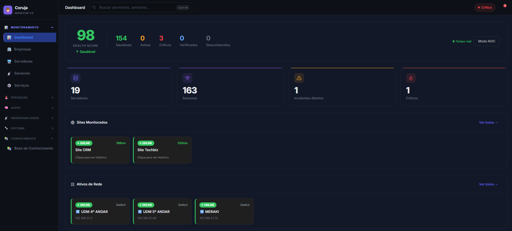
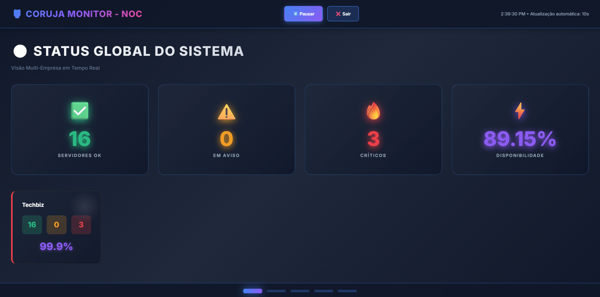
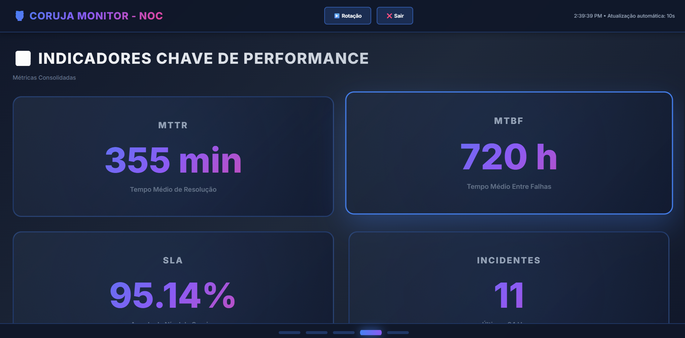
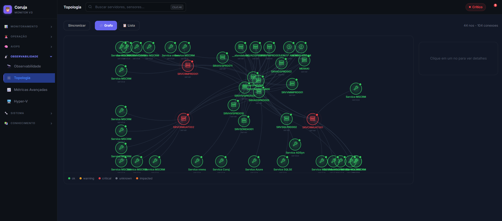
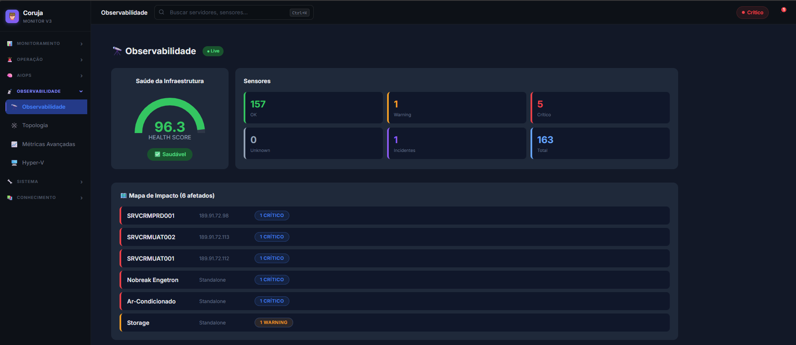
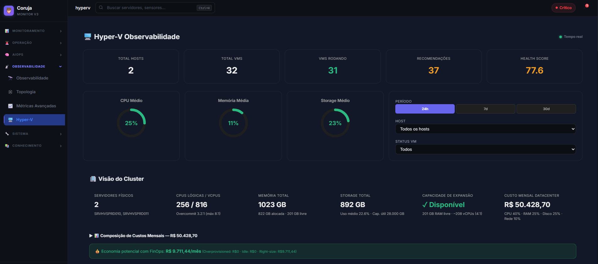
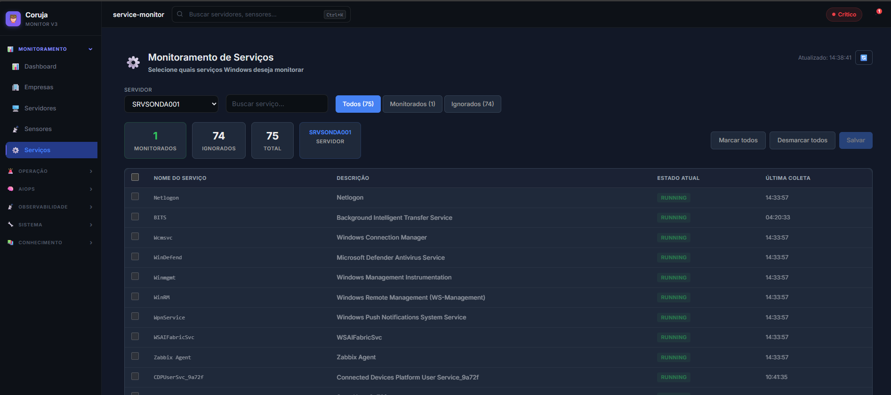

# 🦉 Coruja Monitor v3.6 — Enterprise AIOps Platform

> **Plataforma de monitoramento inteligente de infraestrutura com IA local (Ollama), pipeline AIOps v3, escalação automática via Twilio e observabilidade completa.**


---

## 📸 Screenshots

### Dashboard Principal

> Health Score em tempo real, KPIs de servidores e sensores, sites monitorados com latência, ativos de rede e incidentes recentes. Suporte a WebSocket para atualização em tempo real.

### Modo NOC — Status Global

> Visão wall-screen com status global do sistema, disponibilidade por empresa e KPIs de servidores OK, em aviso e críticos.

### Modo NOC — Painel Completo

> Rotação automática entre painéis: Status Global, Mapa de Calor, Incidentes Ativos, KPIs e Datacenter. Atualização a cada 10 segundos.

### Atividades da IA (AIOps)

> Pipeline v3 com 5 agentes + Ollama llama3.2 gerando diagnósticos em português. 1247 análises, 209 auto-resoluções, 100% taxa de sucesso, 3135 minutos economizados.

### Topologia de Rede

> Grafo interativo com 44 nós e 104 conexões. Visualização de dependências, blast radius e status em tempo real de toda a infraestrutura.

### Observabilidade

> Health Score da infraestrutura, mapa de impacto com servidores e sensores críticos, alertas inteligentes ativos.

### Hyper-V Observabilidade

> 2 hosts físicos, 32 VMs (31 rodando), custo mensal R$ 50.428,70, recomendações FinOps com economia potencial de R$ 8.711,44/mês.

### Serviços

> Monitoramento de serviços Windows com status, modo de inicialização e histórico de disponibilidade.

### Base de Conhecimento

> Base de conhecimento com problemas catalogados, soluções e histórico de resoluções automáticas.

---

## 🚀 O que há de novo na v3.6

### AIOps & IA
- **Ollama llama3.2** integrado ao pipeline — análise em português de todos os incidentes críticos
- **Pipeline v3 com 5 agentes**: AnomalyDetection → Correlation → RootCause → Decision → AutoRemediation
- **Atividades da IA** populadas com dados reais (`ai_agent_logs`, `intelligent_alerts`)
- **Predições de falha** com regressão linear nas métricas dos últimos 6h (117k+ amostras)
- Janela do pipeline ampliada para **7 dias** (era 30 minutos)

### Notificações & Escalação
- **1 notificação por incidente por 24h** — controle persistido no banco (sobrevive restart do Redis)
- **HTTP alarma após 3 falhas consecutivas** (≥3 minutos fora) — evita falsos positivos
- **Matriz padrão corrigida**: HTTP e PING enviam apenas email/teams por padrão
- **Botão 🔕 Parar Ligações** — bloqueia escalação por 24h
- **Botão ✓ Reconhecer** — para todas as notificações automaticamente
- **Botão 📣 Re-enviar** — força re-dispatch manual de todos os canais
- **Botão 🔄 Reabrir** — reabre incidentes reconhecidos/resolvidos

### Incidentes
- **Modal de detalhes** com análise da IA (Ollama) e causa raiz
- **Sensores standalone** (Nobreak, Ar-condicionado) aparecem corretamente em todos os filtros
- Endpoint `POST /incidents/{id}/reopen` para reabrir via API
- Endpoint `POST /incidents/{id}/stop-calls` para parar ligações via API

### Biblioteca de Sensores
- **Todos os cards clicáveis** com modal de histórico 7 dias
- **Modal por tipo**: Nobreak (fases, bateria, temperatura), Ar-condicionado (máquinas, alarmes), Storage (uso/livre/discos), Impressora (toner, páginas), HTTP (uptime, latência, quedas)
- **Ativos de rede clicáveis** com histórico de PING, latência e sensores do dispositivo

### Dashboard
- **Cards de sites HTTP clicáveis** com histórico 7 dias, gráfico de latência e quedas
- **Busca global** com páginas do sistema (Configurações, Escalação, NOC, etc.)
- Health Score e Observabilidade incluem sensores standalone

### Observabilidade
- **Health-summary** filtrado por tenant com sensores standalone
- **Mapa de impacto** inclui Nobreak e Ar-condicionado como nós críticos
- **Topologia** com blast radius usando vizinhos diretos

---

## 🏗️ Arquitetura

```
┌─────────────────────────────────────────────────────────────┐
│                    CORUJA MONITOR v3.6                       │
├─────────────┬──────────────────┬───────────────────────────┤
│  Frontend   │    Backend API   │        Worker              │
│  React 18   │  FastAPI + WS    │  Celery + Beat             │
│  ~70 comps  │  60+ routers     │  Pipeline AIOps v3         │
│  Recharts   │  PostgreSQL      │  Ollama llama3.2           │
│  Dark Mode  │  TimescaleDB     │  Twilio (SMS/WA/Call)      │
└─────────────┴──────────────────┴───────────────────────────┘
         ↑                ↑                    ↑
    Nginx Proxy      Redis Streams        Probe Windows
    (80/443)         Cache + Locks        NSSM Service
```

### Máquinas

| Máquina | OS | Papel |
|---|---|---|
| Kiro (dev) | Windows | Desenvolvimento |
| SRVSONDA001 | Windows Server | Sonda — CorujaProbe via NSSM |
| srvcmonitor001 | Linux | Servidor principal — Docker |

### Stack Tecnológica

| Camada | Tecnologia | Versão |
|---|---|---|
| Backend | FastAPI | 0.109+ |
| Worker | Celery + Redis | 5.3 + 7 |
| Banco | PostgreSQL + TimescaleDB | 15 + 2.14 |
| IA Local | Ollama + llama3.2 | Latest |
| Frontend | React + Recharts | 18 |
| Notificações | Twilio | 8.0+ |
| Proxy | Nginx | Alpine |

---

## 📁 Estrutura do Projeto

```
CorujaMonitor/
├── api/                    # FastAPI — 60+ routers
│   ├── routers/
│   │   ├── incidents.py    # CRUD + reopen + redispatch + stop-calls
│   │   ├── escalation.py   # Escalação contínua + recursos + histórico
│   │   ├── notifications.py # Matriz de notificação + Twilio
│   │   ├── dashboard.py    # Overview + health-summary (com standalone)
│   │   ├── observability.py # Health score + impact map (com standalone)
│   │   ├── predictions.py  # Predições de falha (regressão linear)
│   │   ├── ai_activities.py # Atividades IA (ai_agent_logs + intelligent_alerts)
│   │   └── topology.py     # Grafo de topologia + blast radius
│   └── models.py
├── worker/                 # Celery tasks + escalação + notificações
│   ├── tasks.py            # Pipeline principal + AIOps + Ollama
│   ├── notification_dispatcher.py  # Matriz de canais + dispatch
│   └── escalation.py       # Estado Redis + ciclos de ligação
├── probe/                  # Sonda Windows (SRVSONDA001)
│   ├── probe_core.py
│   ├── collectors/         # 30 coletores (WMI, SNMP, Ping, etc.)
│   └── parallel_engine.py
├── frontend/src/
│   └── components/         # ~70 componentes React
│       ├── Dashboard.js    # Cards clicáveis + modal HTTP 7 dias
│       ├── Incidents.js    # Reabrir + parar ligações + re-dispatch
│       ├── SensorLibrary.js # Cards clicáveis por tipo de sensor
│       ├── EscalationConfig.js # Escalação + alarmes pendentes
│       ├── AIActivities.js # Atividades IA com modal detalhes
│       └── Topbar.js       # Busca global com páginas do sistema
├── ai_agents/              # Pipeline AIOps v3
│   ├── pipeline_orchestrator.py
│   ├── anomaly_detection.py
│   ├── correlation.py
│   ├── root_cause.py
│   ├── decision.py
│   └── auto_remediation.py
├── core/spec/              # Fonte única da verdade (enums + models)
├── alert_engine/           # Supressor, grouper, prioritizer, notifier
├── topology_engine/        # Grafo de topologia + blast radius
└── docker-compose.yml
```

---

## 🔧 Instalação e Deploy

### Pré-requisitos

- Docker + Docker Compose v2
- Git
- Conta Twilio (SMS, WhatsApp, Ligações)
- Python 3.11+ (para a sonda Windows)

### Deploy no Linux (srvcmonitor001)

```bash
# Clonar repositório
git clone https://github.com/Quirinodsg/CorujaMonitor.git
cd CorujaMonitor

# Configurar variáveis de ambiente
cp .env.example .env
# Editar .env com suas credenciais

# Criar tabelas do AIOps (primeira vez)
docker compose up -d postgres
docker exec -it coruja-postgres psql -U coruja -d coruja_monitor -c "
CREATE TABLE IF NOT EXISTS ai_agent_logs (
    id SERIAL PRIMARY KEY,
    run_id TEXT NOT NULL,
    agent_name TEXT NOT NULL,
    input JSONB DEFAULT '{}',
    output JSONB DEFAULT '{}',
    status TEXT DEFAULT 'success',
    error TEXT,
    timestamp TIMESTAMPTZ DEFAULT NOW()
);
CREATE TABLE IF NOT EXISTS intelligent_alerts (
    id SERIAL PRIMARY KEY,
    run_id TEXT,
    title TEXT,
    severity TEXT DEFAULT 'warning',
    status TEXT DEFAULT 'open',
    root_cause TEXT,
    confidence FLOAT DEFAULT 0.0,
    recommended_actions JSONB DEFAULT '[]',
    affected_hosts JSONB DEFAULT '[]',
    created_at TIMESTAMPTZ DEFAULT NOW(),
    resolved_at TIMESTAMPTZ
);
CREATE TABLE IF NOT EXISTS ai_feedback_actions (
    id SERIAL PRIMARY KEY,
    action_id TEXT,
    run_id TEXT,
    agent_name TEXT,
    action_type TEXT,
    target_host TEXT,
    result TEXT,
    outcome TEXT,
    resolution_time_seconds FLOAT,
    timestamp TIMESTAMPTZ DEFAULT NOW()
);"

# Baixar modelo Ollama
docker compose up -d ollama
docker exec -it coruja-ollama ollama pull llama3.2

# Subir todos os serviços
docker compose up -d --build
```

### Atualização

```bash
cd /home/administrador/CorujaMonitor
git pull
docker compose up -d --build api worker frontend
```

### Comandos Operacionais

```bash
# Ver logs da API
docker logs coruja-api -f

# Ver logs do worker (AIOps, notificações, escalação)
docker logs coruja-worker -f --tail=50

# Reiniciar worker (sem rebuild)
docker compose restart worker

# Ver escalações ativas no Redis
docker exec -it coruja-redis redis-cli KEYS "escalation:*"

# Parar todas as ligações (emergência)
docker exec -it coruja-redis redis-cli FLUSHDB

# Reabrir incidentes reconhecidos
docker exec -it coruja-postgres psql -U coruja -d coruja_monitor -c \
  "UPDATE incidents SET status='open', acknowledged_at=NULL, acknowledged_by=NULL WHERE status='acknowledged' RETURNING id, title;"
```

---

## 🤖 Pipeline AIOps v3

### Fluxo de Análise

```
Incidente criado
      ↓
1. AnomalyDetectionAgent  — detecta padrões anômalos nas métricas
      ↓
2. CorrelationAgent       — correlaciona com outros incidentes
      ↓
3. RootCauseAgent         — identifica causa raiz
      ↓
4. DecisionAgent          — decide se deve alertar
      ↓
5. AutoRemediationAgent   — executa ações de remediação
      ↓
6. OllamaAnalysisAgent    — gera diagnóstico em português (llama3.2)
      ↓
Salva em ai_agent_logs + intelligent_alerts
```

### Configuração do Ollama

```yaml
# docker-compose.yml
worker:
  environment:
    - OLLAMA_BASE_URL=http://ollama:11434
    - AI_MODEL=llama3.2
```

---

## 📞 Escalação Contínua

### Fluxo de Notificação

```
Sensor crítico detectado
         ↓
Incidente criado (status: open)
         ↓
Notificações IMEDIATAS (1x por 24h):
  • Email ✅
  • Teams ✅
  • SMS (Twilio) ✅
  • WhatsApp (Twilio) ✅
  • Ligação automática (Nobreak/Ar-condicionado) ✅
         ↓
AIOps analisa em background
  • Preenche root_cause
  • Gera diagnóstico Ollama
         ↓
Escalação contínua (se configurada):
  • Liga a cada X minutos
  • Até Y tentativas
  • Modo: simultâneo ou sequencial
```

### Controles na Interface

| Botão | Ação |
|---|---|
| ✓ Reconhecer | Para todas as notificações por 24h |
| 🔕 Parar Ligações | Para escalação + bloqueia por 24h |
| 📣 Re-enviar | Força re-dispatch de todos os canais |
| 🔄 Reabrir | Reabre incidente e limpa cooldowns |

### Configuração Twilio

```json
{
  "twilio": {
    "account_sid": "ACxxxxxxxx",
    "auth_token": "xxxxxxxx",
    "from_number": "+13136314318",
    "to_numbers": ["+5531991888803", "+5531992140128"]
  },
  "whatsapp": {
    "account_sid": "ACxxxxxxxx",
    "auth_token": "xxxxxxxx",
    "from_number": "+14155238886",
    "phone_numbers": ["+5531991888803"]
  },
  "escalation": {
    "enabled": true,
    "mode": "simultaneous",
    "interval_minutes": 3,
    "max_attempts": 10,
    "phone_chain": [
      {"name": "Andre", "number": "+5531991888803"},
      {"name": "Bruno", "number": "+5531992140128"}
    ]
  }
}
```

---

## 📊 Matriz de Notificação Padrão (v3.6)

| Sensor | Email | Teams | SMS | WhatsApp | Ligação | Ticket |
|---|---|---|---|---|---|---|
| ping | ✅ | ✅ | ❌ | ❌ | ❌ | ❌ |
| http | ✅ | ✅ | ❌ | ❌ | ❌ | ❌ |
| cpu/memory/disk | ✅ | ✅ | ❌ | ❌ | ❌ | ❌ |
| service | ✅ | ✅ | ❌ | ❌ | ❌ | ❌ |
| **engetron (Nobreak)** | ✅ | ✅ | ✅ | ✅ | ✅ | ❌ |
| **conflex (Ar-cond.)** | ✅ | ✅ | ✅ | ✅ | ✅ | ❌ |
| snmp | ✅ | ✅ | ❌ | ❌ | ❌ | ❌ |

> A matriz pode ser customizada por tenant em **Configurações → Notificações → Matriz de Notificação**

---

## 🖥️ Sonda Windows (CorujaProbe)

### Instalação

```powershell
# Instalar como serviço NSSM
nssm install CorujaProbe "C:\Python311\python.exe" "C:\Program Files\CorujaMonitor\Probe\probe_core.py"
nssm set CorujaProbe AppDirectory "C:\Program Files\CorujaMonitor\Probe"
nssm start CorujaProbe
```

### Coletores Disponíveis

| Coletor | Protocolo | Descrição |
|---|---|---|
| WMI | WMI | CPU, Memória, Disco, Uptime, Serviços |
| SNMP | SNMP v1/v2c/v3 | Switches, APs, Roteadores |
| Engetron | HTTP | Nobreak UPS com fases e bateria |
| Conflex | SNMP | Ar-condicionado com temperatura |
| EqualLogic | SNMP | Storage Dell com uso e discos |
| Printer | SNMP | Impressoras com toner e páginas |
| Hyper-V | WMI | VMs, hosts, custo FinOps |
| ICMP/Ping | ICMP | Disponibilidade de hosts |

### Logs

```powershell
Get-Content "C:\Program Files\CorujaMonitor\Probe\logs\service_error.log" -Wait -Tail 50
```

---

## 🗺️ Navegação do Sistema

| Categoria | Páginas |
|---|---|
| **Monitoramento** | Dashboard, Empresas, Servidores, Sensores, Serviços |
| **Operação** | Incidentes, Alertas Inteligentes, Escalação, Timeline, NOC |
| **AIOps** | AIOps v3, Atividades da IA, Predições de Falha |
| **Observabilidade** | Observabilidade, Topologia, Métricas Avançadas, Hyper-V |
| **Sistema** | Discovery, Probe Nodes, Saúde, GMUD, Configurações |
| **Conhecimento** | Base de Conhecimento |

---

## 🔍 Busca Global

A barra de busca (Ctrl+K) encontra:
- **Servidores** — por hostname ou IP
- **Sensores** — por nome ou tipo
- **Incidentes abertos** — por título
- **Páginas do sistema** — Configurações, Escalação, NOC, AIOps, etc.

---

## 📈 Funcionalidades por Módulo

### Dashboard
- Health Score em tempo real via WebSocket
- Cards de sites HTTP clicáveis com histórico 7 dias (uptime, latência, quedas)
- Ativos de rede com status em tempo real
- Seção Datacenter (Nobreak, Ar-condicionado, Storage, Impressoras)
- Filtros por empresa e criticidade

### Incidentes
- Filtros por status e severidade
- Botões de ação: Reconhecer, Reabrir, Re-enviar notificações, Parar ligações
- Modal de detalhes com análise da IA e causa raiz
- Suporte a sensores standalone (sem servidor)

### Escalação
- Cadeia de contatos com ordem de ligação
- Modo simultâneo ou sequencial
- Configuração ao vivo (muda durante escalação ativa)
- Alarmes pendentes de escalação visíveis mesmo sem Redis

### Biblioteca de Sensores
- Cards clicáveis com modal de histórico 7 dias
- Dados específicos por tipo (Nobreak, Ar, Storage, Impressora)
- Ativos de rede com histórico de PING e sensores

### AIOps v3
- Pipeline de 5 agentes rodando a cada 5 minutos
- Ollama llama3.2 para análise em linguagem natural
- Logs persistidos em `ai_agent_logs`
- Alertas inteligentes em `intelligent_alerts`
- Modal de detalhes com análise completa

### Predições de Falha
- Regressão linear nas métricas das últimas 6 horas
- Horizonte de 24 horas
- Filtros por severidade (critical, warning, info)
- 117k+ amostras persistidas em `prediction_samples`

### Topologia
- Grafo interativo com force-layout
- Vista em lista com busca
- Blast radius e dependências
- Sincronização automática com servidores monitorados

### Hyper-V
- 2 hosts físicos, 32 VMs
- CPU, Memória, Storage médio
- Custo mensal do datacenter
- Recomendações FinOps (economia potencial)
- Filtros por host e status de VM

---

## 🔒 Segurança

- Autenticação JWT com refresh token
- MFA (TOTP) disponível
- RBAC: admin e usuário normal
- Isolamento por tenant (multi-empresa)
- Credenciais WMI criptografadas no banco
- HTTPS via Nginx + Let's Encrypt

---

## 📋 Variáveis de Ambiente

```env
# Banco de dados
POSTGRES_DB=coruja_monitor
POSTGRES_USER=coruja
POSTGRES_PASSWORD=sua_senha

# Redis
CELERY_BROKER_URL=redis://redis:6379/0
CELERY_RESULT_BACKEND=redis://redis:6379/0

# IA
OLLAMA_BASE_URL=http://ollama:11434
AI_MODEL=llama3.2

# JWT
SECRET_KEY=sua_chave_secreta
ALGORITHM=HS256
ACCESS_TOKEN_EXPIRE_MINUTES=43200

# Domínio
CORUJA_DOMAIN=coruja.techbiz.com.br
```

---

## 🐛 Troubleshooting

### API não sobe (502 Bad Gateway)
```bash
docker logs coruja-api --tail=30
# Verificar erros de sintaxe nos routers
```

### Worker não processa tasks
```bash
docker logs coruja-worker --tail=30 | grep -E "ERROR|error"
# Verificar se Redis está acessível
docker exec -it coruja-redis redis-cli ping
```

### Ollama não responde
```bash
# Verificar se o modelo está baixado
docker exec -it coruja-ollama ollama list
# Testar
curl http://localhost:11434/api/generate -d '{"model":"llama3.2","prompt":"teste","stream":false}'
```

### Notificações duplicadas
```bash
# Marcar incidentes como já notificados
docker exec -it coruja-postgres psql -U coruja -d coruja_monitor -c \
  "UPDATE incidents SET ai_analysis = COALESCE(ai_analysis, '{}'::jsonb) || jsonb_build_object('notified_at', NOW()::text) WHERE status IN ('open', 'acknowledged');"
```

### Parar todas as ligações (emergência)
```bash
docker exec -it coruja-redis redis-cli FLUSHDB
```

---

## 📝 Changelog

### v3.6 (Abril 2026)
- Integração Ollama llama3.2 no pipeline AIOps
- Notificações 1x por 24h persistidas no banco
- HTTP alarma após 3 falhas consecutivas (≥3 min)
- Matriz padrão corrigida (sem ticket/SMS em HTTP/PING)
- Cards clicáveis em toda a Biblioteca de Sensores
- Ativos de rede clicáveis com histórico de PING
- Modal de detalhes de incidentes com análise IA
- Busca global com páginas do sistema
- Botões de controle de notificação nos incidentes
- Observabilidade e health score incluem sensores standalone
- Topologia com blast radius corrigido

### v3.5 (Fevereiro 2026)
- Enterprise Hardening
- Pipeline AIOps v3 com 5 agentes
- Escalação contínua via Twilio
- Hyper-V Observabilidade com FinOps
- Modo NOC com rotação automática

### v3.0 (Janeiro 2026)
- Arquitetura v3 com TimescaleDB
- Coleta paralela na sonda
- Topologia de rede
- Base de Conhecimento

---

## 👥 Equipe

**Desenvolvido por:** Techbiz Infraestrutura  
**Contato:** infraestrutura@techbiz.com.br  
**Versão:** 3.6 — Abril 2026

---

*Coruja Monitor — Monitoramento inteligente que nunca dorme* 🦉
